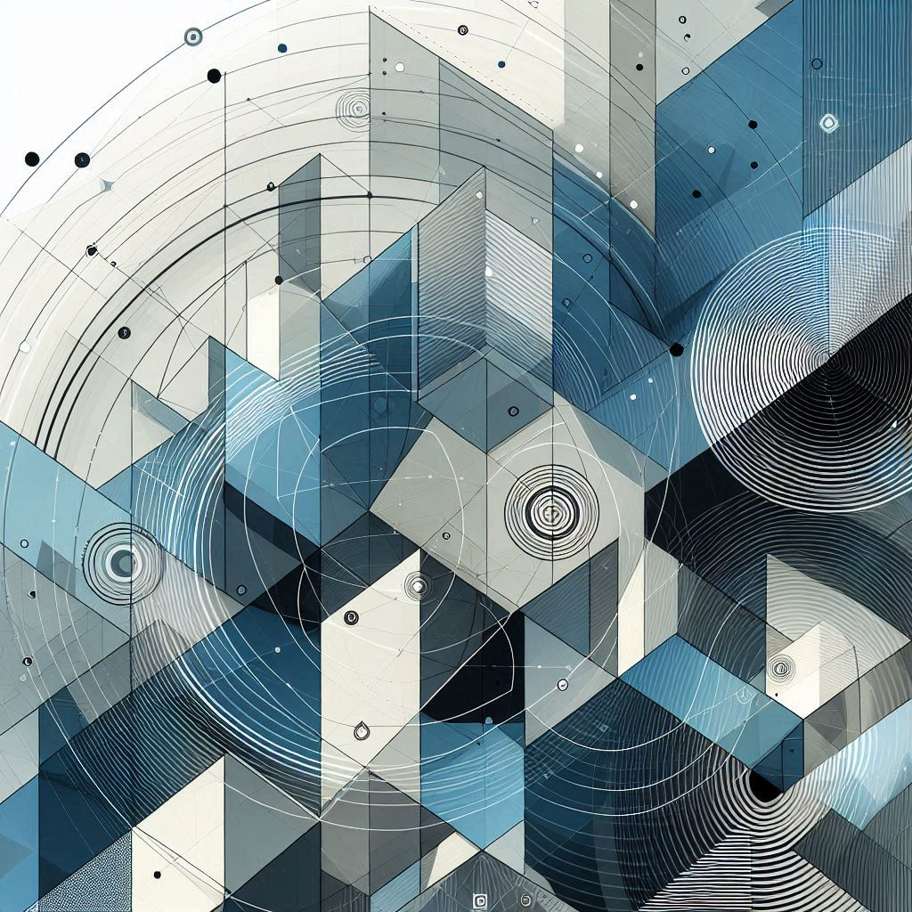
<!--
_class: lead invert
_paginate: skip
_header: ""
-->

# Le triathlon de la data sportif
Capture / Analyse / ~~Quantify~~ Exploitation

https://github.com/zRenard/RivieraDev2024

*Enregistrement video*

<!--
* Enregistrement si ca marche ?
-->
---

# Agenda

* Capture
    * Capteurs
* Analyse
    * Les informations fournies par ces capteurs
* Quantifier (plutôt utiliser/exploiter)
    * Les interprétations de ces informations
* Code (Léger)
    * https://github.com/zRenard
<!-- 
50 min de talk

30 min de presentation
3 Axes
* le matériel, les capteurs utilise
* les data que ces capteurs nous fournisse
* Comment et pourquoi les montres, plateformes utilisent ces donnes. Et ce que nous pouvons en tirer, ou les exploiter
    * Utilisation personnelle
    * Exploitations marketing

* Et en seconde partie, on regardera un peu de code dans ce sens.
Cette partie durera 20 min de code/demos/questions

-->

---
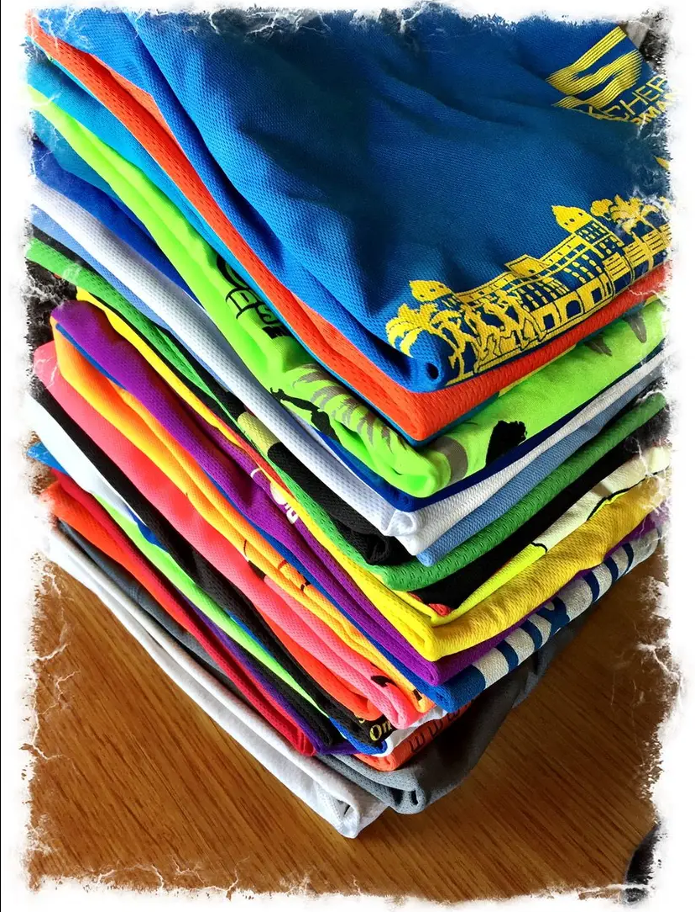

### Whoooo are you hooowouuuh
#### Denis Méline - Sportif

* Sportif depuis 40 ans
* Triathlète depuis un peu plus de 10 ans 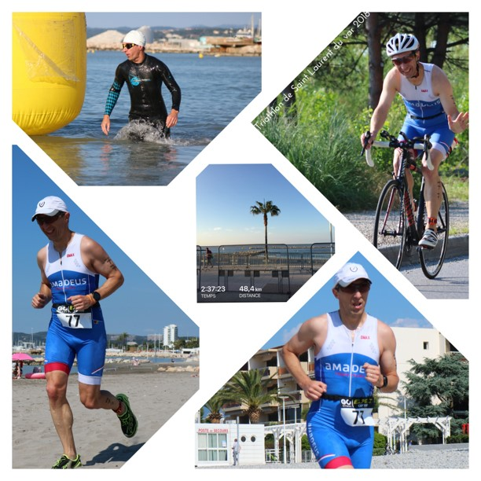
* ~200 courses réelles et virtuelles, toutes disciplines confondues 
* Course à pied, cyclisme, natation, trail, triathlon, golf, tir et autres trucs chelou

* 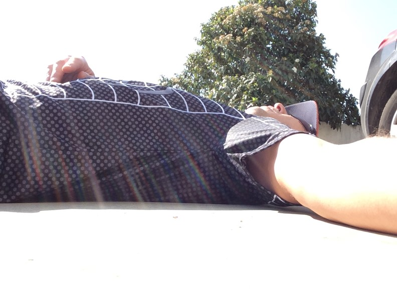

---
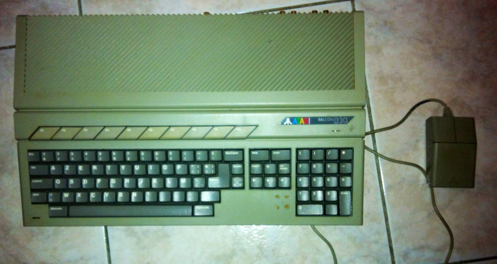

### Whoooo are you hooowouuuh
#### Denis Méline - Ingénieur informatique

* Codeur depuis 45 ans
* DEA informatique théorique
* 25 ans dans l'industrie
* 20 ans à 
* Alpha/beta/contributeur de zwift, garmin, form, runalizer, smashrun, wahoo, decathlon, etc..

---
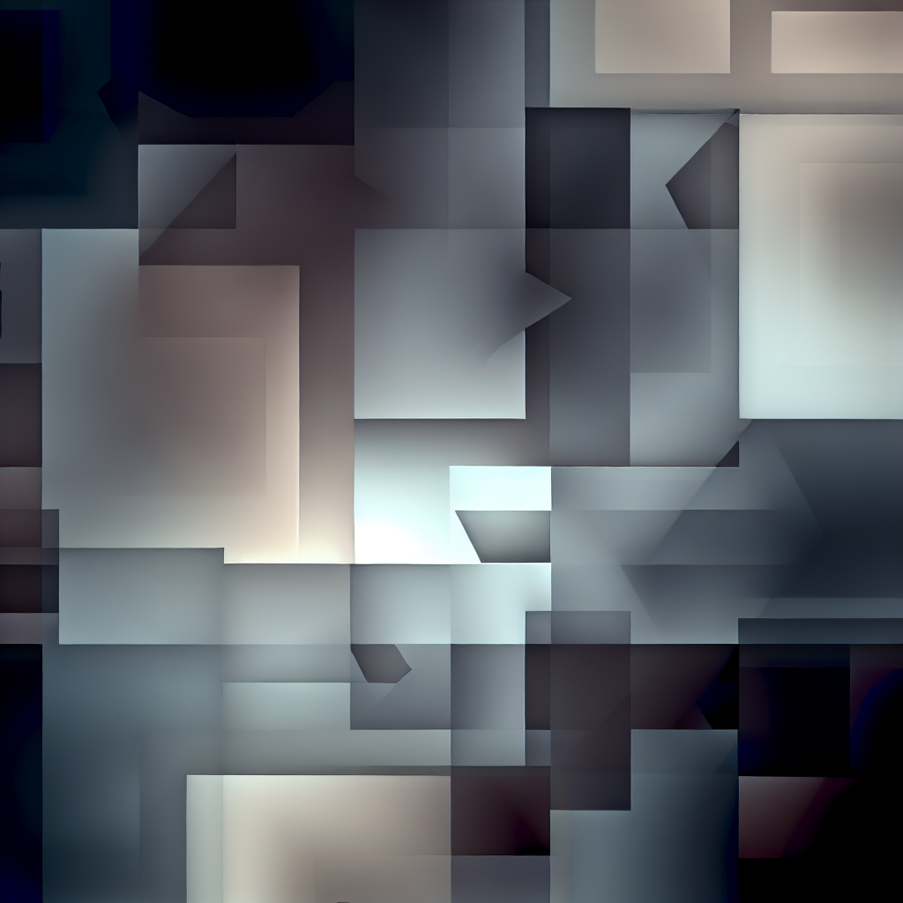
<!--
_class: lead invert
-->
# Capture
---

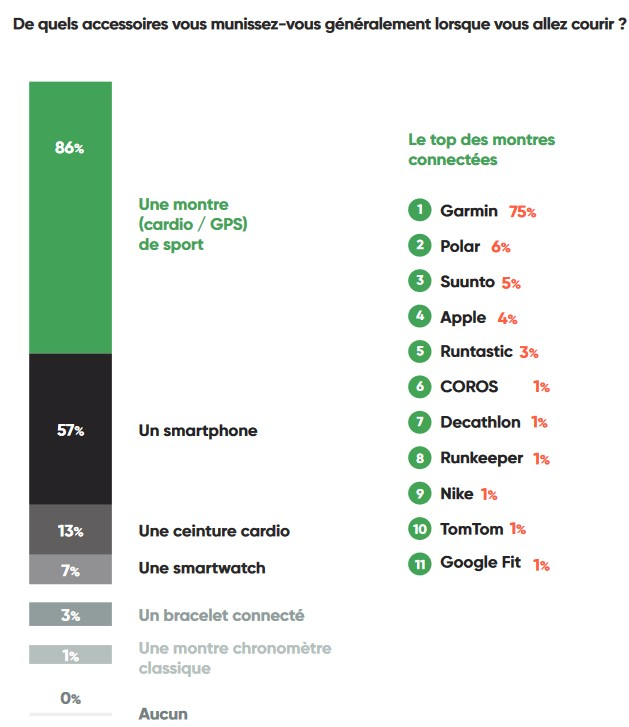

# Les capteurs communs

* Temps !
* Fréquence cardiaque
* Positionnement (GPS …)
* Accéléromètre / Gyroscope
* Baromètre
* Oxymètre

<!-- 
* Ceinture (électrique), optique
* GPS (US), Galileo (EU), Beidou (CH), Glonass (RU), QZSS (JP)
* Source : https://filieresport.com/fr/telechargements?k=24166577&u=%2Fsante-et-bien-etre%2F2023-06-12%2Fdocuments-en-telechargements-libres&from=articles&f=odr2023_701338359.pdf&d=20230616+19%3A51%3A32&i=4815&vx=433159755
* Finalement, peu de type de capteurs comparer aux exploitations

-->

---

# Les capteurs avancés

* ECG
* Thermomètre
* Puissance/couple
* Pression
* Glycémie
* Tensiomètre
* Contacteurs

<!-- 
Pression pour l'aero
Contacteurs pour le vitesse vélo
-->
---

# Les capteurs "exotiques"

* Luminosité
* UV
* Lidar
* Radar
* Photos/Vidéos
* Balance (Poids, masse hydrique, masse osseuse, etc...)
* Débitmètre
<!-- 
* Lidar *(Light Detection and Ranging - Ondes dans le spectre visible - Courte distance, très précis)*
* Radar *(Radio Detection and Ranging - Ondes électromagnétiques - Grande distance, peu précis)*
* Luminosité : pour les écrans mais aussi pour les feux vélo ou même frontale
-->

---
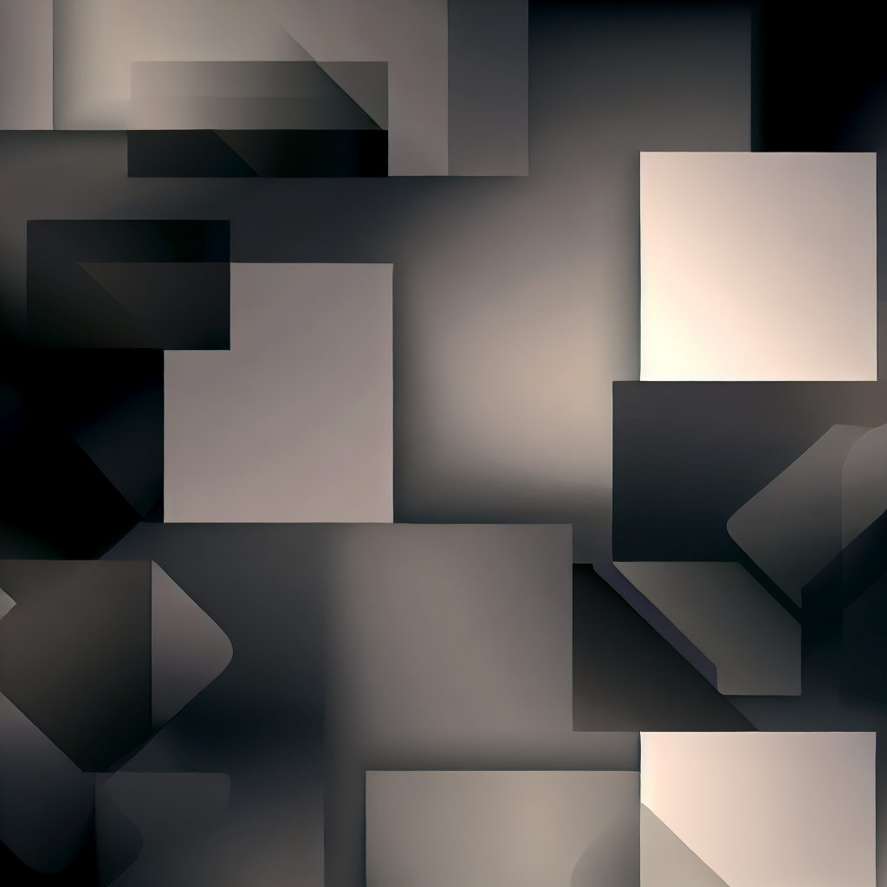
<!--
_class: lead invert
-->
# Analyses

<!--
Analyse brute, on prend juste en compte le contexte, pas "trop" d'algorithme.
Juste du nettoyage, raffinement
-->
---
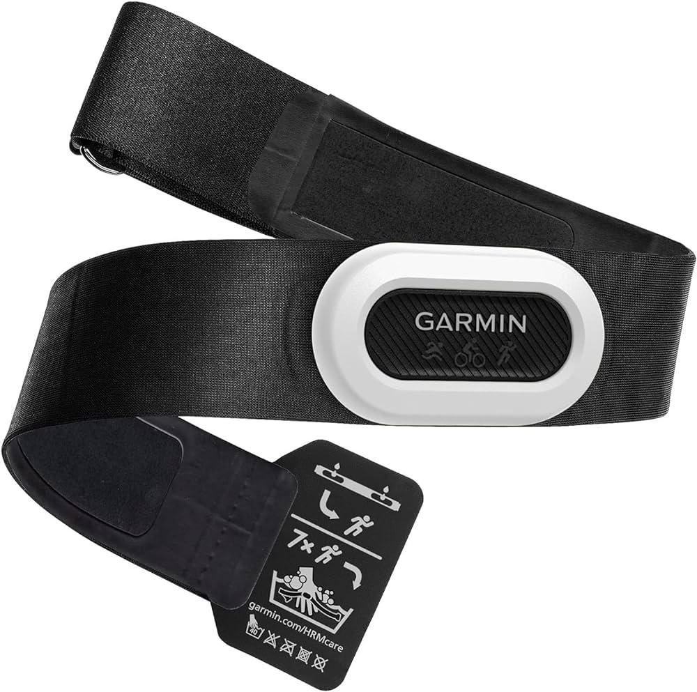
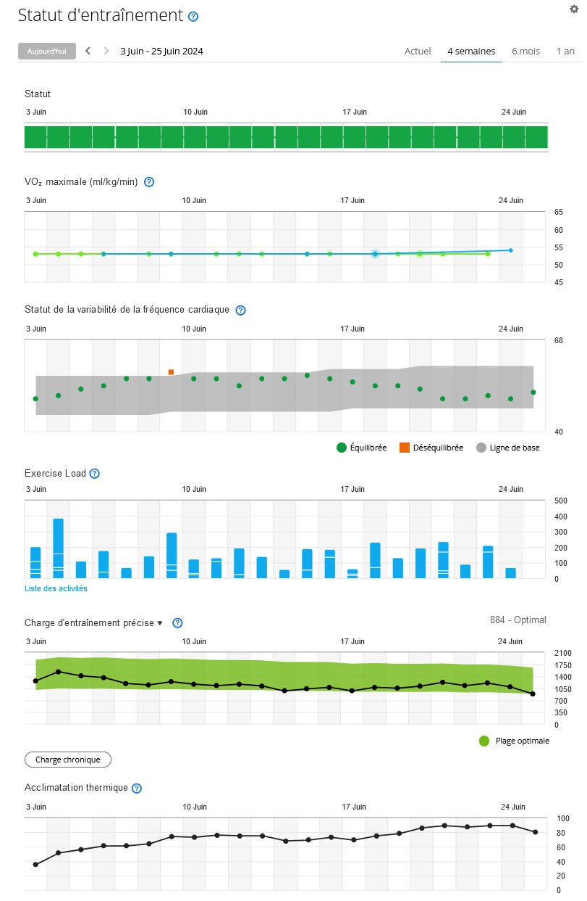

# La fréquence cardiaque

* Context de capture
    * Sommeil
    * Course à pied, vélo, natation
* Fréquence d’échantillonnage
* Type
    * Optique
    * Électrique
* FCMax, FCRec, Variabilité cardiaque (VFC)

<!--
* Le "profil" utilisé impacte l'algorithme de lissage et de correction utilisé.

* FCMax
* FCRecuperation
    * 2min après FCMax
* VFCRepos
    * Calcul VFC la nuit
* Variabilité cardiaque (VFC)
    * https://www.researchgate.net/profile/Marco-Altini
-->
---

# Le positionnement

* Context de capture
    * Course à pied, vélo, natation
* Fréquence d’échantillonnage
* L'ajout de capteurs correctif/amélioratif
    * altimètre
    * baromètre
    * podomètre
* Cartes (navigation, retour maison ...)
<!-- 
Par exemple dans le sport mécanique, la fréquence d’échantillonnage est importante, on peut rater quelques mètres de précisions uniquement due à la vitesse
-->

---
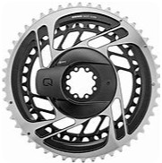
# Capteur de puissance

* Watts
* Puissance spécifique W/kg
* l’équivalent du cardio mais pour le vélo

* 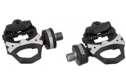
* 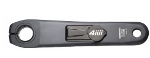

* https://journals.physiology.org/doi/pdf/10.1152/advan.00078.2011

---
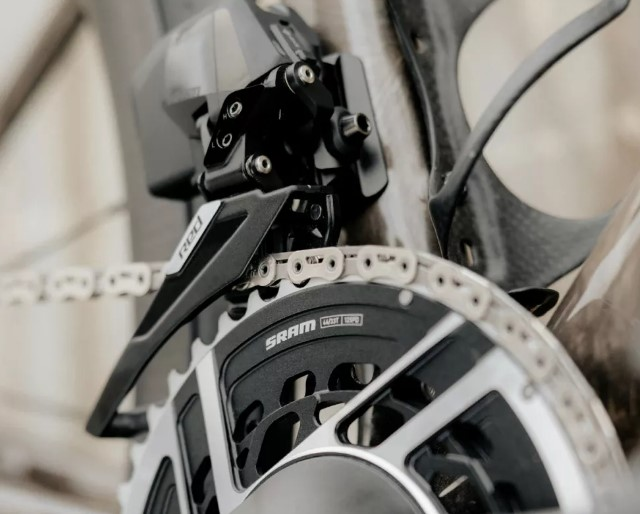
# Vitesse électrique
* Shimano (filaire)
* SRAM (sans fils)
* Position du plateau, des pignons
* Radio
* 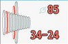

---
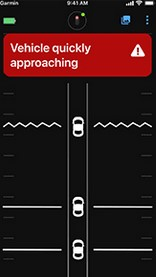
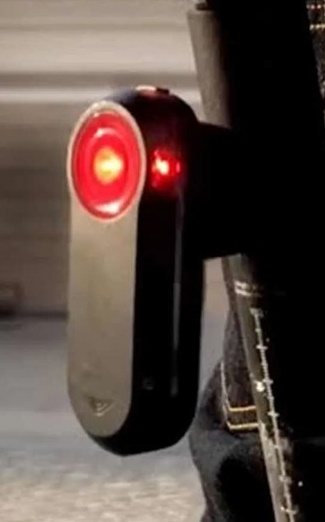
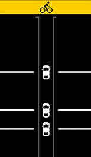
# Radar vélo
* Garmin, iGP, Wahoo, Sigma
* Pour la sécurité
    * Changement de l’éclairage
    * Detection des véhicules et leur type
    * Detection des vitesses des véhicules

---

# Capteur Glycémie

* SuperSapiens
    * https://www.supersapiens.com/fr-FR/
* Demo
    [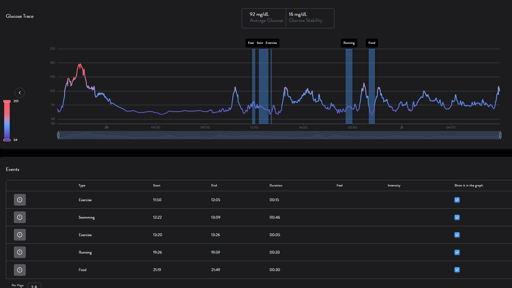 ](supersapiens2.jpg)
* Maintenant interdit en compétition
<!-- 
-->

---

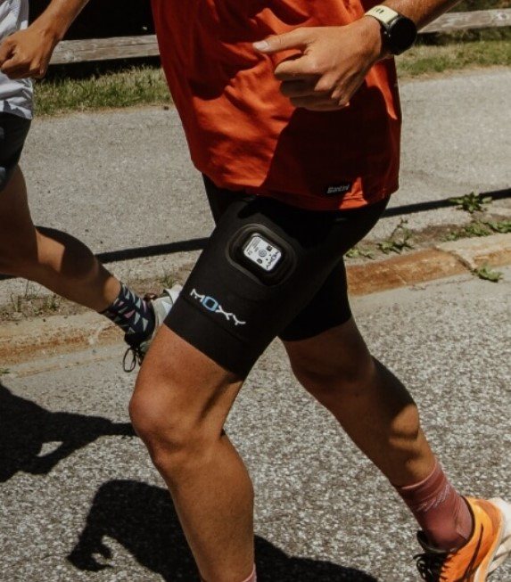
# Oxymètre

* Moxy
    * % SmO2 (skeletal muscle oxygen saturation)
    * https://www.moxymonitor.com/

* https://www.blog.nolio.io/post/tout-savoir-sur-le-moniteur-doxygene-musculaire-moxy
* https://pubmed.ncbi.nlm.nih.gov/37261552/

<!-- 
-->

---
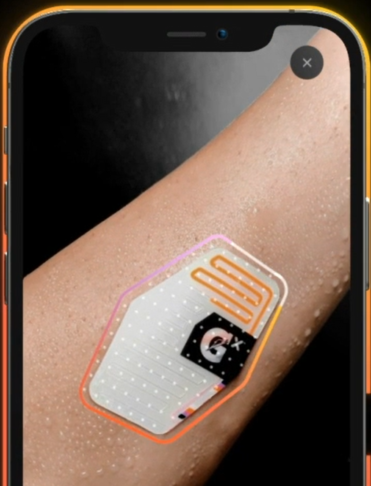
# Capteur .....

---
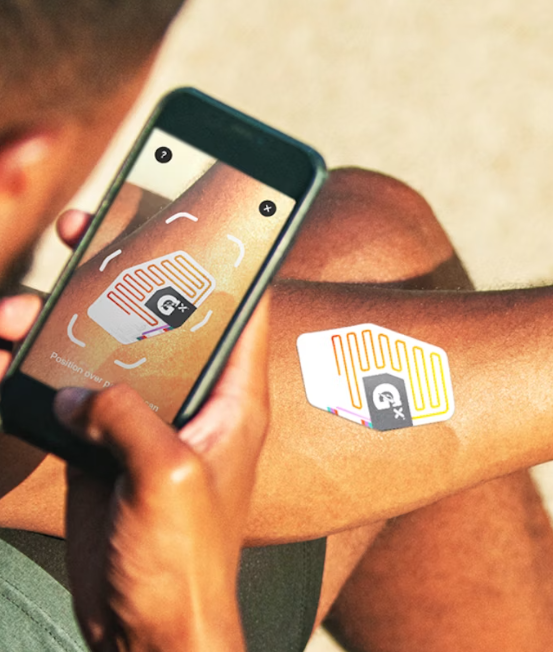

# Capteur Sueur
* Le but étant de minimiser la perte hydrique et minérale/électrolytes (majoritairement sodium, potassium, magnésium, zinc)
* Limite d'absorption (à l'effort) ~ 400/500ml/h
* Santé (Crampes,Nausées,Confusion)
* https://hdroptech.com/
* https://www.gatorade.com/equipment/gx-sweat-patch/gx-sweat-patch-00052000052596

---
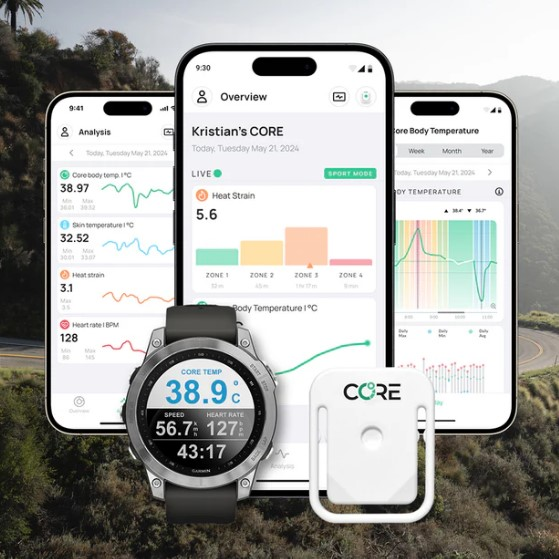
# Capteur température
* http://www.ncbi.nlm.nih.gov/pmc/articles/PMC3359364/
* 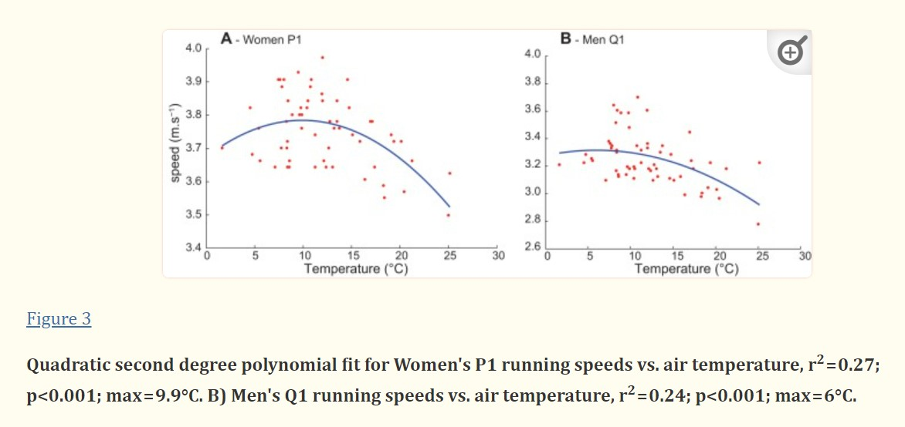
* 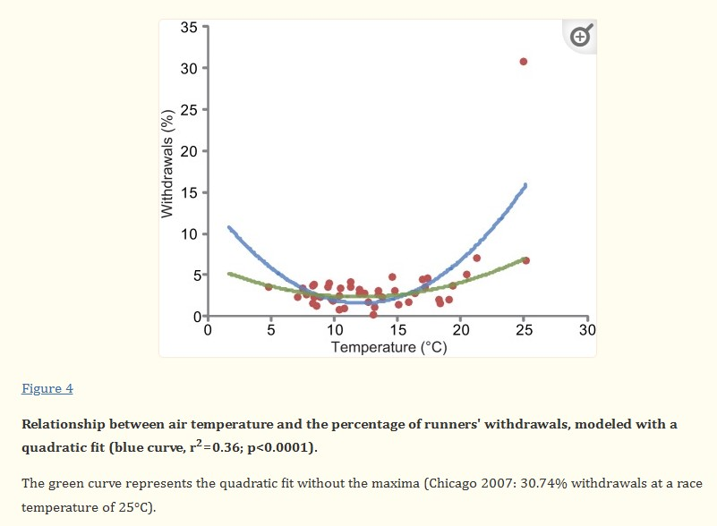

<!-- 
* Impact important !
https://corebodytemp.com/products/core
-->

---
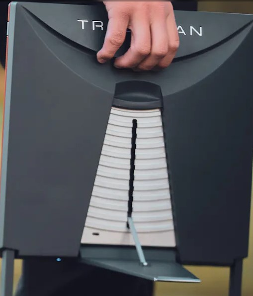
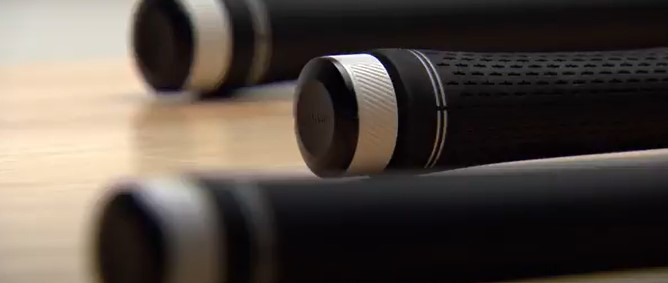
# Radar/Lidar de Golf

* 40 paramètres
* Garmin
* Trackman [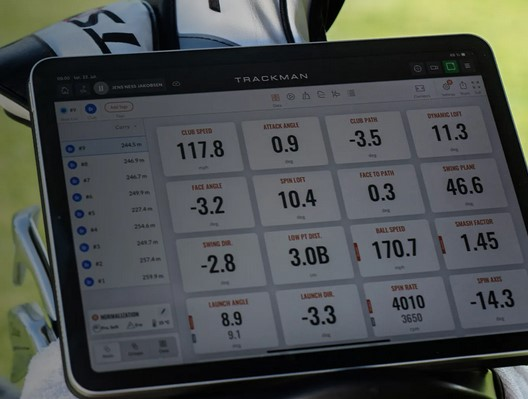 ](trackman1.jpg)
* FlightScope [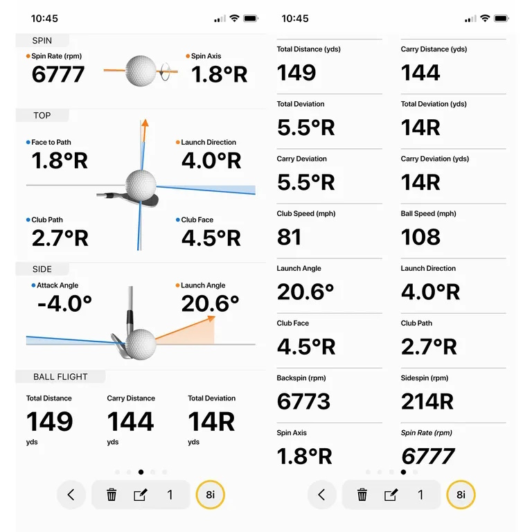 ](golf-data.jpg)
* TrueSwing [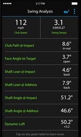 ](trueswing.jpg)

<!--
 -Pas d’interprétation
 * Trackman, FlightScope
 * https://www.trackman.com/fr
 * Garmin Approach
* https://www.garmin.com/fr-FR/p/605172/pn/010-01994-00
-->
---
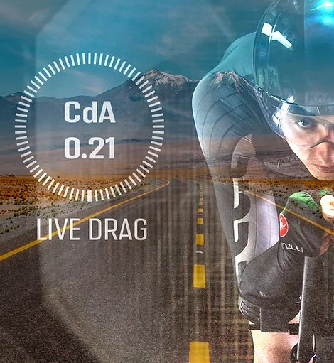

# Capteur de pression

* Pression suspensions
    * Pour le confort (et la perf)
* Pression pneus
    * Pour la sécurité (et la perf)
* Traînée Aérodynamique en temps réel
    * Multiples capteurs (dont pression de l'air)
    * Optimisation pour les pros

<!--
    * https://www.sks-germany.com/fr/airspy/
    * https://www.sram.com/en/quarq/series/tyrewiz

    * https://fr.aeroscale.bike/
    * https://www.bodyrocket.cc/how-does-it-work

Body Rocket utilise une combinaison de plusieurs capteurs
Puissance, Pression de l'air, vitesse du vent, vitesse, accélération, inclinaison, poids pour 
fournir un coefficient en temps réel.
-->

---
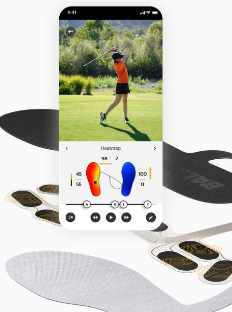
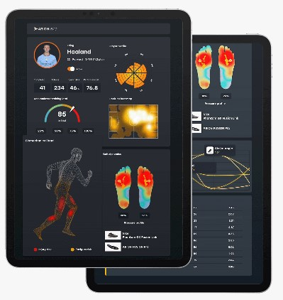
# Capteur de pression

* Semelles pour le golf
    * 18 capteurs pour fournir angles, impact, symétrie, etc...
    * Optimisation pour les pros
    * https://www.bal-on.golf/
* Semelles pour la course à pied
    * https://www.digitsole.com/running-analysis

<!--
Golf -> focus performance
Course à pied -> focus diminution risque de blessure, de moins en moins pour le grand public
-->

---
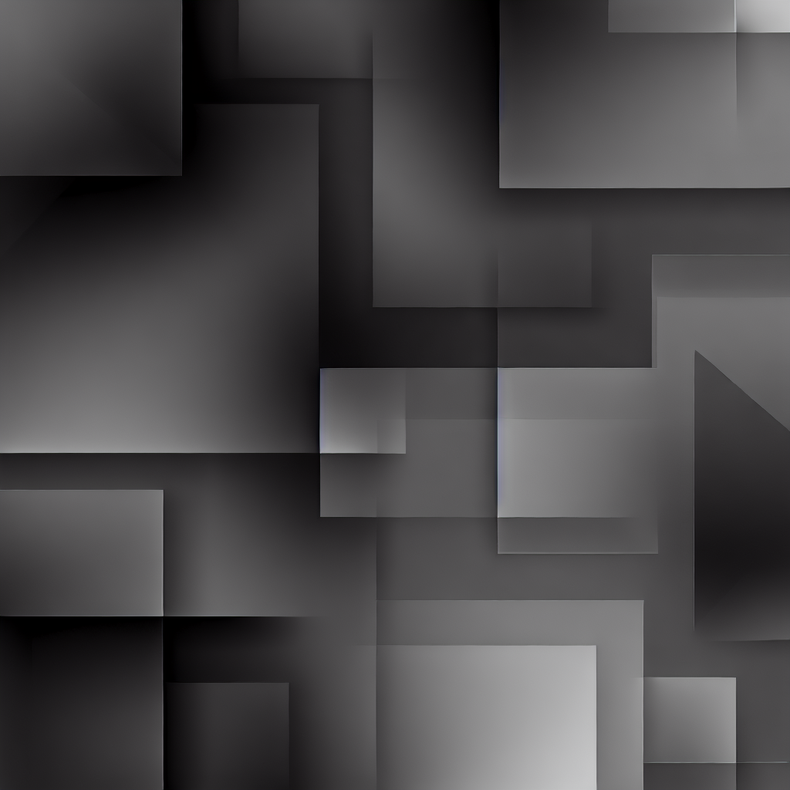
<!--
_class: lead invert
-->
# Exploitation

---
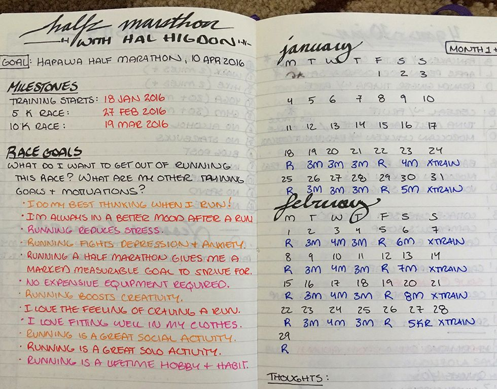
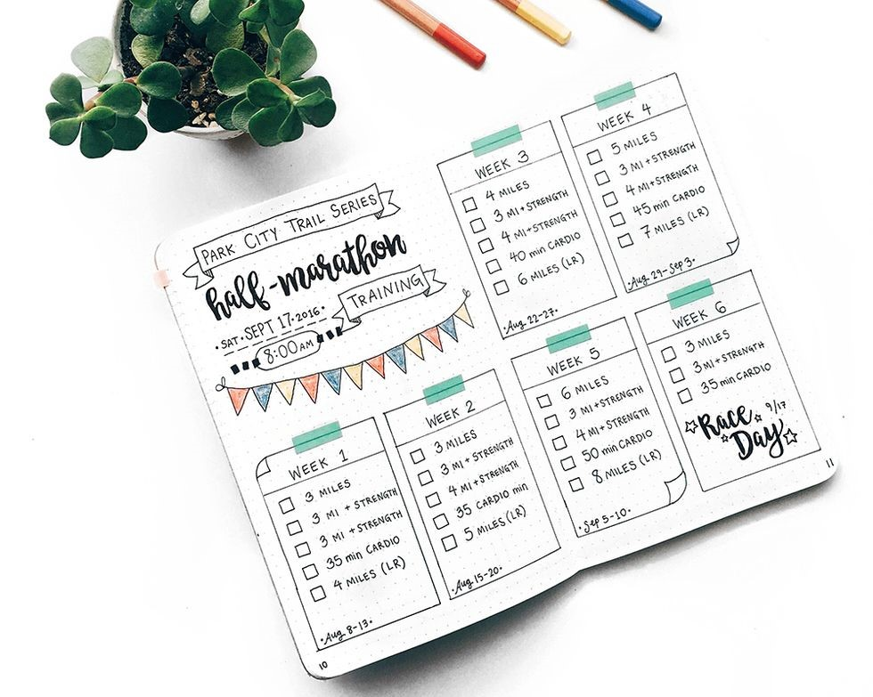

# Le journal d’entraînement (Training log)
* Papier
* En ligne
* Application

<!--
Y a 40 ans, FC avant, 1500m, FC, puis 2min après FC
-->

---
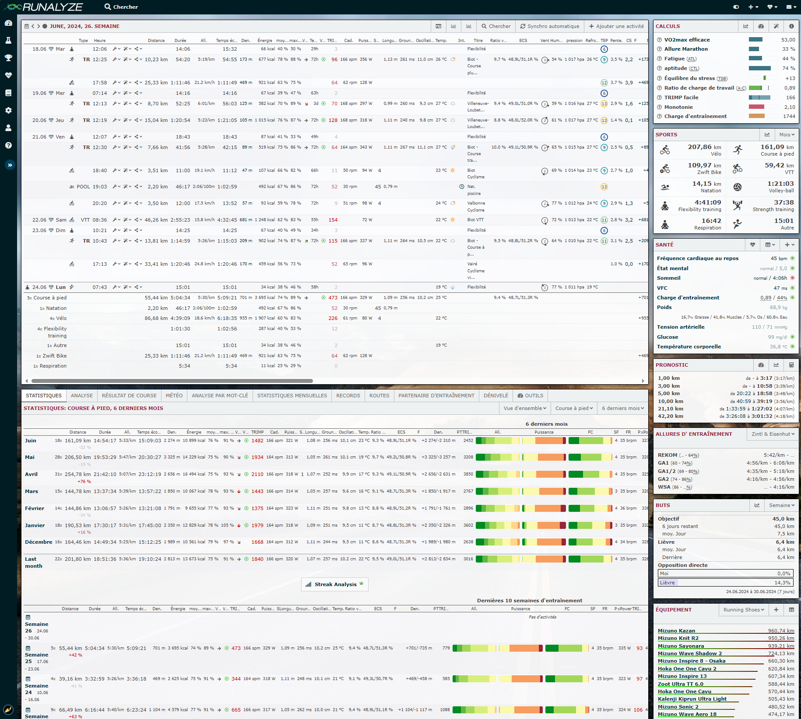

# Plateformes

##### Applications dédiées
https://www.strava.com/
https://runalyze.com/
https://smashrun.com/
https://www.nolio.io/
https://web.gutai.training/login
https://intervals.icu/
https://app.campus.coach/

---

# Plateformes

##### Constructeurs (voir plus loin)
https://connect.garmin.com/
https://flow.polar.com/
Application mobile Suunto

##### Applications sponsors équipementiers (voir plus loin)
https://www.runtastic.com/ (Adidas)
https://beta.trainasone.com/ (Hoka)
https://www.nike.com/nrc-app (Nike)
https://runkeeper.com/ (Asics)
https://www.mapmyrun.com/ (UnderArmor)

---
# Plateformes

##### AI (Bien sûr !)
https://en.run-motion.com/
https://humango.ai/
https://aiendurance.com/
https://www.sciencetraining.io/

---

# Plateformes
* Certaines métriques sont subjectives et/ou manuelle
    * Très facile -> très difficile
    * Sensation : Horrible -> très fort
    * Age, Poids
* C’est très subjectif et sujet à interprétation voire erreur.
* Les algorithmes utilisés sont parfois publics, parfois sous licence, et souvent secrets.
* Produits par la recherche mais aussi les plateformes et les constructeurs (d’où leur propre plateformes)

<!--
* Démo : Runalyze (https://runalyze.com/)
-->
---
# Résultats

* 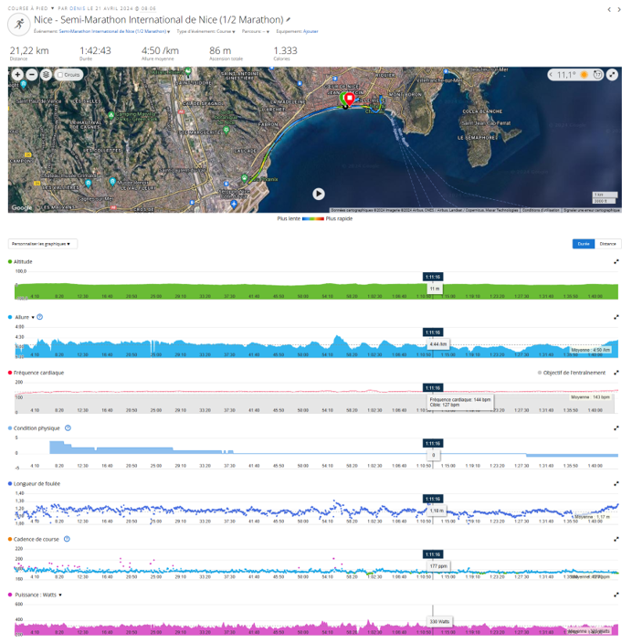
* 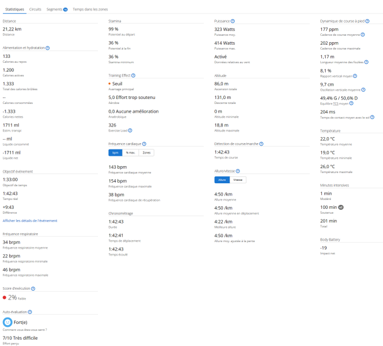
* 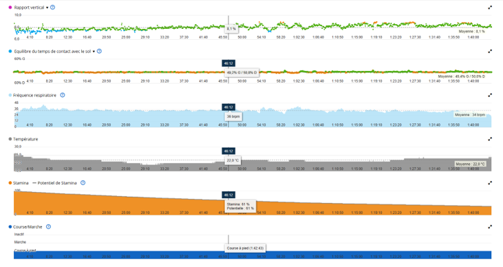
* 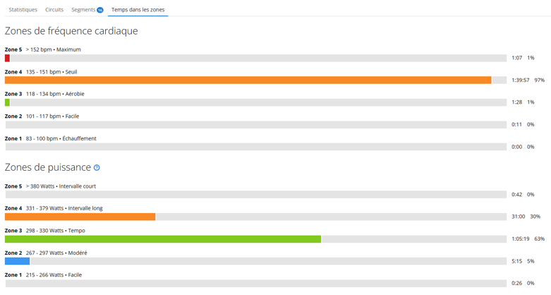

* 
* 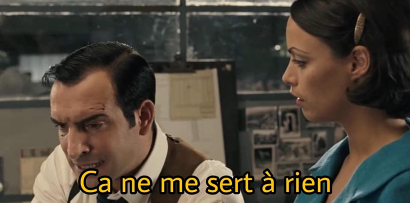

---
# Analyse Cardio - Prediction de course

* Multiples méthodes (Dave Cameron, Pete Riegel, Robert Bock (CPP), Herbert Steffny)
* Avec multiples métriques (FCMax, FRec, courses précédentes, etc.. )

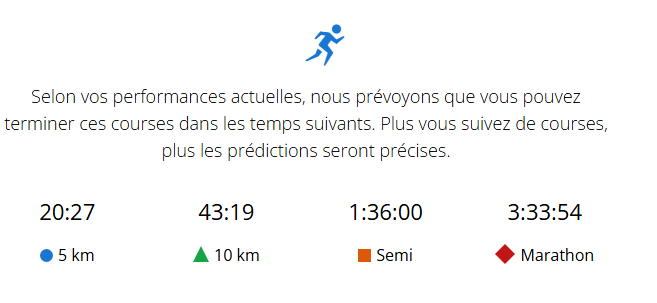
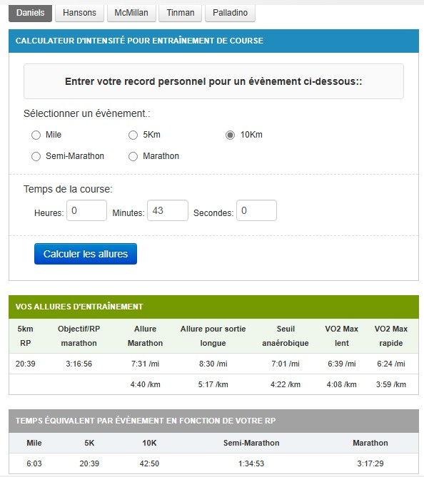

<!--
C'est bien d'avoir la FCRec, ca donne une idée de la capacité en encaisser la séances
si >50BPM entre FCMax et FCRec, la séance a bien était assimiler.
Mais on peut faire mieux, par exemple, la FCRecuperation permet de calculer les predictions de course.

Idem pour le triathlon :
https://www.nature.com/articles/s41598-023-38181-y.pdf

* On peut hacker : https://pubmed.ncbi.nlm.nih.gov/2022559/
-->

---
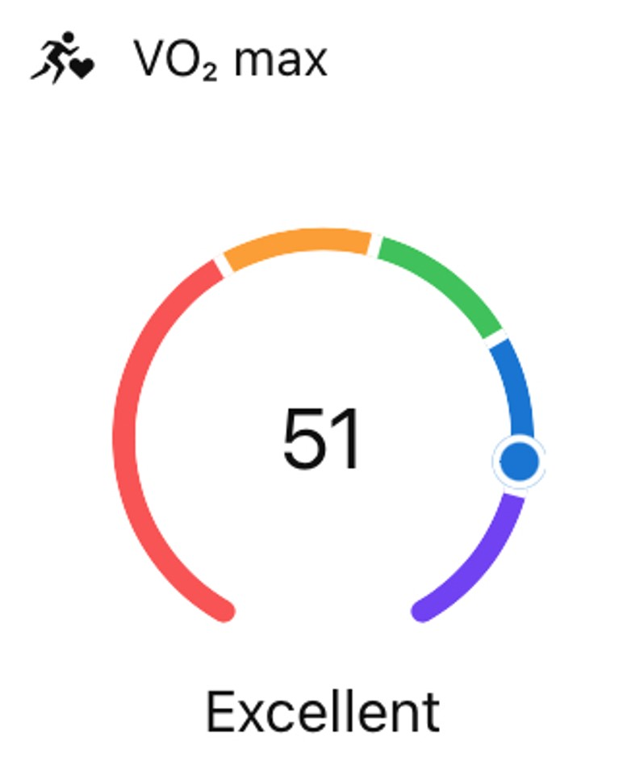

# Analyse Cardio - Vo2Max

* Vo2Max = La consommation maximale __d'oxygène__ que l'organisme peut absorber lors d'un effort physique intense
* En réalité -> Prédiction de Vo2Max
* L'algorithme de calcul -> Firstbeat, secret déso 😅
    * Age, poids, cardio, ...

<!--
https://www.youtube.com/watch?v=rMLYizEoVBI
https://www.youtube.com/watch?v=u-5UOPwCWHk
-->

---
# Test Vo2Max

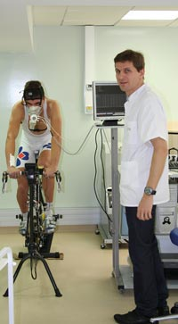

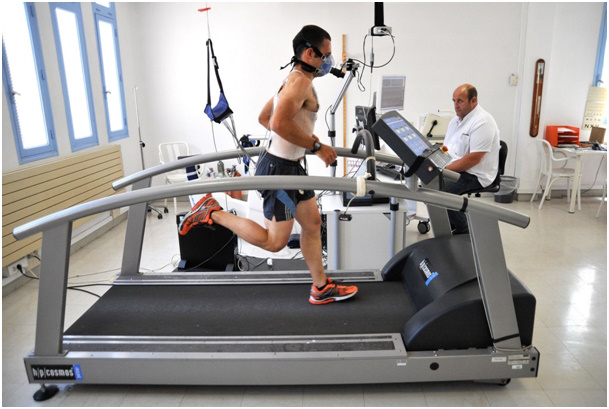

<!--
https://www.im2s.mc/evaluation-de-la-forme-physique-les-tests-deffort/
-->

---
# Analyse avec les capteurs de mouvements

* Qualité du sommeil 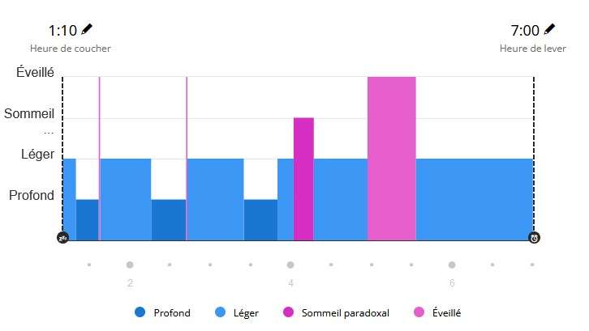
* Équilibre 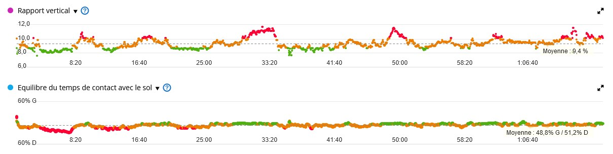
* Longueur de foulée
* Efficacité de la foulée 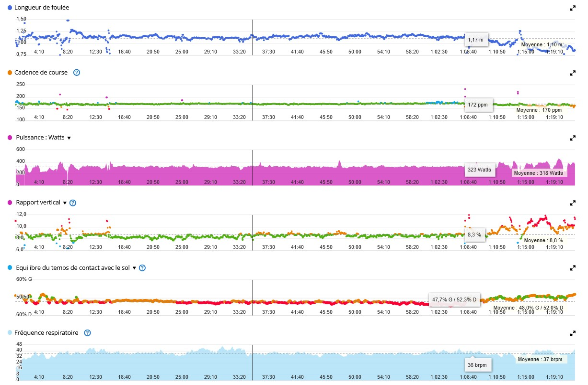
* Détection d’incident
* Invitation à bouger/boire

<!--
* Avant pour les voitures si elles étaient renversées (Au US)
Pour une voiture, c'est assez facile, si elle est sur le toit, c'est mauvais signe.
Pour le sport, le context est important.
Bizarrement, pour le VTT, la detection d'incident est désactiver.
Invitation à bouger, on verra ca dans la partie code aussi.
* Invitation à bouger (même 2h après un marathon 😅)
-->
---
# Lunette Engo

* Uniquement écran déporté
* Aucun capteur
    * enfin si, capteur de luminosité pour ajuster l'écran, mais aucune data produite
* Démo


<!--
Retour direct permet l'ajustement en temps réel

Source : https://fr.engoeyewear.com/produits/engo-2
-->

---

# Lunette Form


* Capteurs classiques (gyros, mouvements)
* Combinaison avec des capteurs existants
    * Depuis la montre
    * Depuis un capteur externe (cardio)
* Autorisée en compétition !
* Démo

<!--
Source : https://www.formswim.com/
-->

---

# Eolab

* Capteurs classiques
    * Capteurs de mouvements
        * Gyroscopes
        * Gyromètres
        * Accéléromètres
    * Pressions (sur et sous la main)
* https://www.eolab.com/swimbetter
* https://link.springer.com/article/10.1007/s00283-024-10339-0


* 
* 

<!--
* Source : https://www.youtube.com/watch?v=uK8ao6-hpcY&ab_channel=eo
-->

---


# Photos et vidéos
* Positionnement
    * Sur le vélo
    * Golf
    * Natation
* Confort
* Optimisation de l'aero
    * Synchronisation avec les capteurs aero

---
# HeatMap

* Les routes/chemins les plus empruntés/validés et securisés
    * Utilisation des donnees des radars/lidar
* HeatMap Nuit, pour les routes sure/pratique la nuit 
* Nouvelle HeatMap contextualisee

* Source : https://www.dcrainmaker.com/2024/05/strava-announces-new-summer-2024-features.html

---
# HeatMap


<!--
Bias de selection : nombre de nageurs + nombre qui ont une montre

Zone d'exclusion:
https://www.sbs.com.au/news/article/a-russian-commander-was-killed-while-jogging-was-he-tracked-through-a-fitness-app/h0vd6ucxd

-->

---
# Utilisation pour le confort et la performance

* Passage de vitesses automatiques sur le vélo 
    * Capteur de puissance, capteur de cadence, vitesse et dérailleurs pilotés électroniquement (avec ou sans fils)

* Source : https://www.decathlon.fr/p/velo-vtt-electrique-all-mountain-tout-suspendu-29-e-feel-900-s/_/R-p-330262

---
# Grade ajusted peace
https://support.strava.com/hc/fr/articles/216917067-Vitesse-ajust%C3%A9e-selon-la-pente-VAP

* Confirmation par des études scientifiques.
    * Energy cost of walking and running at extreme uphill and downhill slopes https://journals.physiology.org/doi/full/10.1152/japplphysiol.01177.2001 

---

# Age ajusted peace

* https://www.triathlete.com/culture/news/how-much-slower-will-you-get-as-you-age-up-in-triathlon/
* Confirmation par des études scientifiques
    * https://pubmed.ncbi.nlm.nih.gov/2504587/
    * https://www.ncbi.nlm.nih.gov/pmc/articles/PMC2375571/

* 
* 
* 
* 

<!--
Plus on est vieux, plus on est bon pour l'endurance : Nop
https://www.triathlete.com/culture/news/data-dive-finishing-times-dnf-rates-and-more-stats-from-the-ironman-world-championship-st-george/
-->

---
# Des data pour le virtuel - Simulation de parcours de golf


<!--
Trackman, FlightScope, Garmin, TopTracer
Video + donnee GPS nettoye
-->

---
# Des data pour le virtuel - FulGaz, Tacx


<!--
Video + donnee GPS nettoye
-->
---
# Des data pour le virtuel - Zwift


<!--
Inclus aussi le tapis de course
Avec vitesse,distance, cadence et inclinaison
-->

---
# Des data pour le virtuel


https://zwiftinsider.com/portal/isola-2000/
https://zwiftinsider.com/portal/la-turbie-col-deze/

---
# Des data pour le virtuel


* Simulation du terrain (Plaques vibrantes + angles)
* Simulation de la pente (+20% -10%)
* Simulation du vent (48km/h !)
    

<!--
Manual Mode: Select from four speed settings to set you ideal airflow
Speed Mode: Pair to KICKR or speed sensor to match fan speed to bike speed
Heart Rate Mode: Pair to ANT+ heart rate monitor to increase airflow as heart rate goes up
-->

---

# La empoisonnement des données

* Involontaire/Volontaire
    * Erreurs GPS,  Bug de traitement, Bug d'upload
    * Brosse à dents electrique (ajoute des pas)
    * Vélo à la place de course à pied ...

* 
* 
* 

* Nettoyage par AI sur Strava cet ete

<!--
* Source : https://www.dcrainmaker.com/2024/05/strava-announces-new-summer-2024-features.html
-->
---
# Utilisation pour tricher

* Gagner des courses virtuelles
    * Des prix mais aussi des contrats !

* Contre mesure
    * Double capteur de puissance (Différentes marques)
    * Double caméra (angles différents)

* Zwift Essoreuse à Salade : https://www.youtube.com/watch?v=K08AlzT6Qu8

<!--
* https://www.dcrainmaker.com/2022/12/zwift-uci-cheating-astounding-championship-qualifier.html
* https://www.dcrainmaker.com/2022/02/zwifts-bans-whistleblower-deeper.html
-->
---
# Fun


* Faire de joli dessins
    * (Pour l'instant) Fait artisanalement

* eSport
    * Cardio, stress
    * Garmin GameOn

---

<!--
_class: lead invert
-->
# Conclusions

---
# Evolutions des capteurs

### Bientôt (quelques mois)
* Temperature peau + corps (avec capteur dedidé)
    * https://corebodytemp.com/products/core
* Glycémie (avec capteur cardio)
    * https://afontechnology.com/glucowear/
* Tension (avec capteur cardio)

---
# Evolutions des analyses/exploitations

### Quelques années (pour le grand public)
* Morphologique
* Physiologique
* Métabolique
* Exemple : Analyseur de quantité de mitochondrie
    * Organite utilisant l'oxydation du glucose et des acides gras pour produire de l'ATP. (= énergie)
    * Optimisation des apports des nutriments.

<!--
Aerobie = >quelques minutes = respiration cellulaire
Anaerobie < 1 minute
Programme de SVT de Terminale : https://www.kartable.fr/ressources/svt/cours/la-production-datp/53709
Le prise d'EPO (érythropoïétine) permet de stimuler la fabrication des érythrocytes (= hématies) et donc d'augmenter l'oxygénation des muscles.

https://www.nakan.ch/wp/2024/03/27/podcast-s02-e02-des-donnees-cest-bien-une-strategie-qui-les-utilise-cest-mieux/

Source : https://doctonat.com/renforcer-augmenter-mitochondrie/
-->
---


# Vos bénéfices

* Pour apprendre à se connaître
    * Retour immediat, correction et validation
* Pour la santé/securite
    * Surveillance, informer, alertes
* Les pro
    * Pour trouver l'optimum de chacun
    * Majoritairement, pour prévenir les blessures
https://www.inria.fr/fr/sport-numerique-prevenir-blessures-athletes-JO

<!--
Course enfants : Depart a fond, milieu en PLS, et finish a fond, et vomit :)

* Pour apprendre à se connaître
    * Les informations et leurs analyse permettant d’accélérer et affiner le processus
    * On affine les entrainements et les sensations grace a des informations instantanées
    * Retour immediat, correction et validation
    * On reduit les bias du a la subjectivité

* Pour la santé/securite
    * Surveillance, informer, alertes

* Les pro
    * Pour trouver l'optimum de chacun
    * Majoritairement, pour prévenir les blessures
    * https://www.inria.fr/fr/sport-numerique-prevenir-blessures-athletes-JO

* https://www.garmin.com/fr-FR/blog/les-donnees-des-montres-connectees-garmin-mettent-en-evidence-les-bienfaits-de-la-course-a-pied-sur-la-sante/
* https://www.garmin.com/en-US/blog/health/xps-network-uses-garmin-smartwatch-tech-to-help-boost-athletic-performance/
-->

---

# Resumé

* Capteurs
    * Toujours plus mais attention au context
* Analyse
    * Context et les combinaisons qui peuvent entrainer des biais
* Exploitation
    * Pour la performance et donc pour le marketing
    * La valeur réelle pour vous !
        * Pour se connaitre, la santé, la sécurité
        * La prévention des blessures (l'utilisation majeure des pro)
---
# Création du triathlon

* 18 Février 1978 
* Pas de capteurs 
* Pas de matériel dédié  
* Et des temps excellents ! 

---

<!--
_class: lead invert
_paginate: skip
_header: ""
_footer: ""
-->
# Merci !

https://openfeedback.io/rivieradev24/0/256