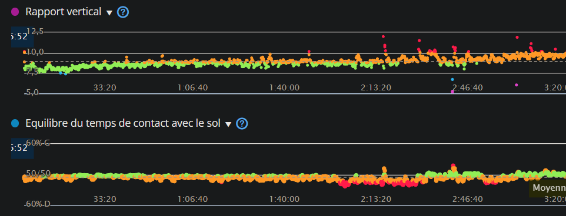

<!--
_class: lead invert
_paginate: skip
-->

# Le triathlon de la data sportif
Capture / Analyse / ~~Quantify~~ Exploitation

---

### Whoooo are you hooowouuuh
### Denis Méline - Sportif

* Sportif depuis 40 ans et triathelete depuis un peu plus de 10 ans.
* ~200 courses réelles et virtuelles, toutes disciplines confonudus. (Course à pied, trail, natation, triathlon, golf et autres trucs chelou)

* 
* 
* 

---

### Whoooo are you hooowouuuh
### Denis Méline - Ingénieur informatique

* Codeur depuis 45 ans
* DEA informatique théorique
* 25 ans dans l'industrie
* Alpha test/contributeur de zwift, garmin, runalizer, smashrun, etc..

---

# Agenda
* Capture
    * Capteurs
        * Precision
        * Type
* Analyse
    * Contexte
    * Paramètres
* Quantify (plutôt utiliser/expoiter)
    * Utilisations personnelle
    * Exploitations marketing
* Code mais fun
    * On peut faire quoi avec tout ça ?
<!-- 
Speaker notes : None
-->
---

<!--
_class: lead invert
-->
# Capture
---

# Capture

* Historique
    * Compteur vélo (cable, electronique avec aimant)
    * Podometre, GPS
    * Multiples matériels
    * Integration
* Explosion des utilisations depuis 5 ans
* Finalement, peu de type de capteurs

---

# Les capteurs commun

* Temps !
* Fréquence cardiaque
    * Ceinture (électrique), optique
* Positionnement (GPS, Galileo, Beidou/Compass, Glonass, QZSS,…)
* Accéléromètre / Gyroscope
    * Capteur de foulée
    * Cadence/vitesse en vélo
    * Autres (Golf, natation, etc..)
* Baromètre
* Oxymètre

<!-- 
GPS (US), Galileo (EU), Beidou (CH), Glonass (RU), QZSS (JP)
-->

---

# Les capteurs avancés

* ECG
* Thermomètre
* Puissance/couple
* Pression
* Glycémie
* Tensiomètre
* Contacteurs

<!-- 
Pression pour l'aero
Contacteurs pour le vitesse vélo
-->
---

# Les capteurs "exotiques"

* Luminosité/UV
* Lidar
* Radar
* Photos
* Videos (Positionnement)
* Débitmétre (t'a bu combien d'eau ce matin ? 😁)
<!-- 
* Lidar *(Light Dectection and Ranging - Ondes dans le spectre visible - Courte distance, tres précis)*
* Radar *(Radio Dectection and Ranging - Ondes electromagnetiques - Grande distance, peu précis)*
-->

---

# Cas particuliers

* Chronométrage
* Batteries (montre, capteurs, vélo électrique, etc..)
* Aero

---

# La fréquence cardiaque
* Début pour le publique : Polar ~1980
    * Transferts via … Infrarouge Polar SxxX
    * Mais aussi .. Flashlights (Polar FTx)

<!-- 
Focus sur les principaux capteurs, les plus ancien, et c'est valables pour la majorité
-->

---

# La fréquence cardiaque
* Fréquence cardiaque
    * Ceinture (électrique)
        * Fiable, précis, temps de réponse réduit
        * PB :  confort (proche du cœur), peu pratique, encore plus pour les femmes.
    * Optique ~2017
        * LEDs + photodiode pour enregistrer la taille des vaisseaux sanguins.
        * PB : Temps de réponse, Température, Eau, peau
    * ECG ~2023
        * Signaux électriques du coeur
    * ~ Variabilité cardiaque (VFC, intervale entre R-R)
<!-- 
-->

---

# Le positionnement
* GPS, Galileo, Beidou/Compass, Glonass, QZSS,…
* Ma premiere montre GPS - 2010
    * GPS uniquement
    * 8 satelites max
    * Precisions quelques metres
    * Fort impact de l'environement
    * Aucune corrections
---

# Le positionnement
* 2024
    * Multiband
    * Multiples satelites
    * Precisions < metre
    * Stabilité
        * Corelation avec d'autres capteurs, comme l'altimetre, le podometre.
    * Fiabilité
        * Dans les forêts, en mer, entre les immeubles, avec perturbations electroniques/magnétiques.

<!-- 
-->

---

<!--
_class: lead invert
-->
# Analyse

---

# La frequence Cardiaque

* Context de capture
    * Sommeil
    * Course a pied, vélo, natation
        * Le "profil" utilisé impact l'algorithme de lissage et de correction utilisé.
* Frequence d'échantillonage
* Type
    * Optique
    * Electrique

* VFC
https://www.researchgate.net/profile/Marco-Altini

---

# Le positionement

* Context de capture
    * Course a pied, vélo, natation
        * Le "profil" utilisé impact l'algorithme de lissage et de correction utilisé.
* Frequence d'échantillonage
* L'ajout de capteurs correctif/amelioratif
    * alimetere
    * barometre
    * podometre

---

# Capteur temperature
* http://www.ncbi.nlm.nih.gov/pmc/articles/PMC3359364/

---

# Capteur Clycémie

* SuperSapiens
    * https://www.supersapiens.com/fr-FR/
* Demo
* Mainteant interdit en compétitions
<!-- 
-->

---

# Capteur ??

---

# Capteur Sueur
* Le but étant de minimiser la perte hydrique et minérales/electrolytes (majoritairement sodium, potatium, mg, zinc)
* Protocole de base
    * Pesé
    * 1h intensive en condition
    * Pesé
    * Difference = perte hydrique ~ 700ml -> 1L
* Pourquoi ?
    * Retenir l'eau
    * Si la concentration de sodium chute -> besoin d'eau ++
        * limite d'absortion (à l'effort) ~ 400/500ml/h
    * Santé
        * Crampes
        * Nnausées
        * Confusion
        * Trouble de la conscience
* https://hdroptech.com/
* https://www.gatorade.com/equipment/gx-sweat-patch/gx-sweat-patch-00052000052596
* http://www.ncbi.nlm.nih.gov/pmc/articles/PMC3359364/

---

# Prediction de course
* Top ! … pas si sûr 
* On peut hacker : https://pubmed.ncbi.nlm.nih.gov/2022559/

---

# Photos et videos
* Positionement sur le vélo
* Optimisation de l'aero
* Confort

<!-- 
-->

---

# Analyse

* Pression
    * Pression pneus
    * Aero
    * Semelles (angles, impact, symetrie)

---

<!--
_class: lead invert
-->
# Exploitation

---
# Resultats

* 
* 
* 
* 

* 
* 

---

# Vo2Max

* Vo2Max = La consommation maximale d'oxygène que l'organisme peut absorber lors d'un effort physique intense
* En réalité -> Prédiction de Vo2Max
* Excelent ?
* Pas si sûr...
* L'algorythme de calcul -> déso, secret 😅

<!--
https://www.youtube.com/watch?v=rMLYizEoVBI
https://www.youtube.com/watch?v=u-5UOPwCWHk
https://www.im2s.mc/evaluation-de-la-forme-physique-les-tests-deffort/
-->

---
# Analyse avec les capteurs de mouvements

---
# Lunette Engo

* Uniquement ecran deporté
* Aucun capteur
    * enfin si, capteur de luminosite pour ajuster l'ecran, mais aucunes data produites
* Demo

<!--
Source : https://fr.engoeyewear.com/produits/engo-2
-->

---

# Lunette Form

* Aucun nouveau capteurs, uniquement l'utilisation de ceux-ci
* Combinaison avec des capteurs existants
    * Depuis la montre
    * Depuis un capteur externe (cardio)
* Autorisée en competition !
* Demo

<!--
Source : https://www.formswim.com/
-->

---

# Eolab

* https://www.eolab.com/swimbetter
* Source : https://www.youtube.com/watch?v=uK8ao6-hpcY&ab_channel=eo

* 
* 

---
# Balance connectée

---
# Gourde intelligente

---

# Le journal d'entrainement (Trainning log)
* Papier
* En ligne
* Application

---

# Platformes

##### Applications dédiées
https://www.strava.com/
https://runalyze.com/
https://smashrun.com/
https://www.nolio.io/
https://web.gutai.training/login
https://intervals.icu/
https://app.campus.coach/

---

# Platformes

##### Constructeurs (see after)
https://connect.garmin.com/
https://flow.polar.com/
Application mobile suunto

##### Applications sponsors équipementiers
https://www.runtastic.com/ (ADDIDAS)
https://beta.trainasone.com/ (Hoka)
https://www.nike.com/nrc-app (Nike)
https://runkeeper.com/ (ASICS)

---
# Platformes

##### AI (Biensur !)
https://en.run-motion.com/
https://humango.ai/
https://aiendurance.com/
https://www.sciencetraining.io/

---

# Platformes
* Certaines métrique utilise en partie, l’auto évaluation
    * Très facile -> très difficile
    * Sensation : Horrible -> très fort
* C’est très subjectif et sujet a interprétation voir erreur.
* Les algorithmes utilisés sont parfois publique, parfois sous licence, et souvent secret.
* Produit par la recherche mais aussi les plateformes et les constructeurs (d’où leur propre plateformes)
* Demo : Runalyze (https://runalyze.com/)

---
# Utilisation pour la securité

* Detection d’incident
    * Avant pour les voitures si elles étaient renverser (Au US)
* Heat map de strava
    * Les routes/chemins les plus empruntés/validés et securisés
    * (A venir) Adding night heat maps to show which routes are better/safer for night workouts

Source : https://www.dcrainmaker.com/2024/05/strava-announces-new-summer-2024-features.html

---
# HeatMap

<!--
Bias de selection : nombre de nageurs + nombre qui ont une montre

Zone d'exclusion:
https://www.sbs.com.au/news/article/a-russian-commander-was-killed-while-jogging-was-he-tracked-through-a-fitness-app/h0vd6ucxd

-->

---
# HeatMap

* Adding night heat maps to show which routes are better/safer for night workouts
* Adding new “Athlete Intelligence” feedback, akin to basic coaching feedback on activities
* Adding “AI-Enabled Leaderboard Integrity” to sniff out improbable uploads

Source : https://www.dcrainmaker.com/2024/05/strava-announces-new-summer-2024-features.html

---
# Utilisation pour le confort et la performance

* Passage de vitesses automatiques sur le vélo
    * Capteur de puissance, capteur de cadence, vitesse et dérailleurs piloté électroniquement (avec ou sans fils)

Source : https://www.decathlon.fr/p/velo-vtt-electrique-all-mountain-tout-suspendu-29-e-feel-900-s/_/R-p-330262

---
# Grade ajusted peace
https://support.strava.com/hc/fr/articles/216917067-Vitesse-ajust%C3%A9e-selon-la-pente-VAP
confirmation par des études scientifiques –Ref : [1] Minetti, A. E. et al. (2002). Energy cost of walking and running at extreme uphill and downhill slopes. Journal of Applied Physiology 93, 1039–1046.

---
# Wind adjusted pace ?

Il existe des formules mais tout est subjectif, il n'y a pas encore de capteurs (hors aero pour le velo)
Strava ne va pas aider, car le vent est environemental, entre les batiments, ou en ras campagne c'est pas la meme limonade.

https://www.youtube.com/watch?v=IoX-JUPvrwo

---
# Utilisation pour des stats
* Age ajusted peace
    * https://www.triathlete.com/culture/news/how-much-slower-will-you-get-as-you-age-up-in-triathlon/
    * Confirmation par des études scientifiques https://pubmed.ncbi.nlm.nih.gov/2504587/
    * Mais aussi https://www.ncbi.nlm.nih.gov/pmc/articles/PMC2375571/

---

---
# Des data pour le virtuel

---
# Des data pour le virtuel

---
# Des data pour le virtuel

https://zwiftinsider.com/portal/isola-2000/
https://zwiftinsider.com/portal/la-turbie-col-deze/

---

# Utilisation pour tricher

* Gagner des courses virtuelles (et donc de cadeaux)
    * Des prix (comme des dossards, ou tirages au sort)
    * Des réductions (pour la revente)
    * Des contrats !
* Demo
* Contre mesure
    * Double capteur de puissance (Differentes marques)
    * Double camera (angles differents)

* Source : Zwift Essoreuse à Salade :https://www.youtube.com/watch?v=K08AlzT6Qu8
* https://www.dcrainmaker.com/2022/12/zwift-uci-cheating-astounding-championship-qualifier.html
* https://www.dcrainmaker.com/2022/02/zwifts-bans-whistleblower-deeper.html

---
# Fun

---
# ESport
Garmin GameOn

---
Data poisonning
* Involontaire
    * 
    * 
    * 

---
Data poisonning
* """"Involontaire"""""
    * Vélo à la place de course à pied
    * Vélo electrique à la place de vélo musculaire
    * Moto/voiture à la place de vélo
---

---
# Evolutions

### Bientôt (quelques mois)
* Temperature peau + corps (avec capteur dedidé)
    * https://corebodytemp.com/products/core
* Glycémie (avec capteur cardio)
    * https://afontechnology.com/glucowear/
* Tension 

---
# Evolutions

### Quelques années (pour le grand publique)
* Morphologique
* Physiologique
* Métabolique
* Analyseur de quantité de mitochondrie

---

# Conclusion

* Pour se connaitre

* Pour sa santé

* Les pro
    * Pour prévenir les blessures
    * https://www.inria.fr/fr/sport-numerique-prevenir-blessures-athletes-JO

<!--
Course enfants : Depart a fond, milieu en PLS, et finish a fond, et vomit :)
-->

---
# Conclusion

* Apprendre à se connaître, les informations et leurs analyse permettant d’accélérer et affiner le processus
* Accepter car les informations sont instantanées
* Affiner car analyser et on réduit la subjectivité 

---

# Conclusion
* Capteurs
    * Attention au contexte de capture !
* Analyse
    * Ecnore une fois contexte
    * Les combinaisons qui peuvent entrainer des bias
* Expoitation
    * Pour la performance (ça c'est pour vendre)
    * Pour le marketing (voir le point au dessus 😁)
    * La valeur reele pour vous !
        * Pour se connaitre
        * La prevention des blessures (l'utilisation majeure des pro)
<!-- 
Speaker notes : None
-->

---
# Creation du triathlon

* 18 Février 1978
* Pas de capteurs, même pas de matériel dédier … et des temps de excellent !

* 
* 
* 
* 

---

<!--
_class: lead invert
_paginate: skip
_header: ""
_footer: ""
-->
# Merci !
