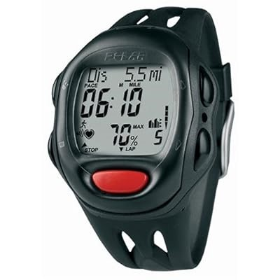
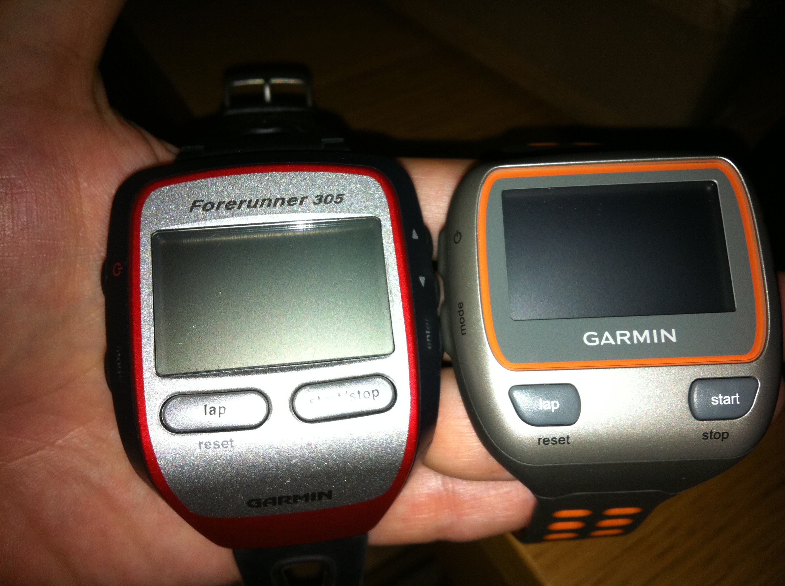
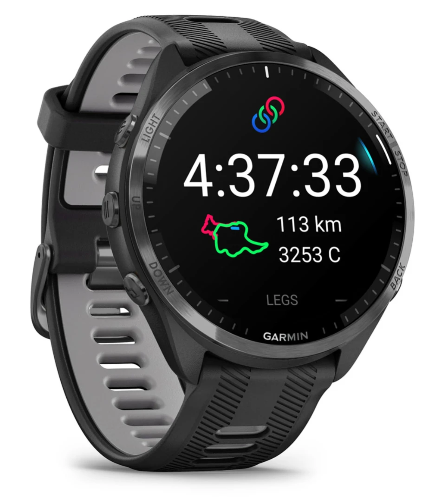
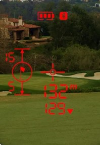
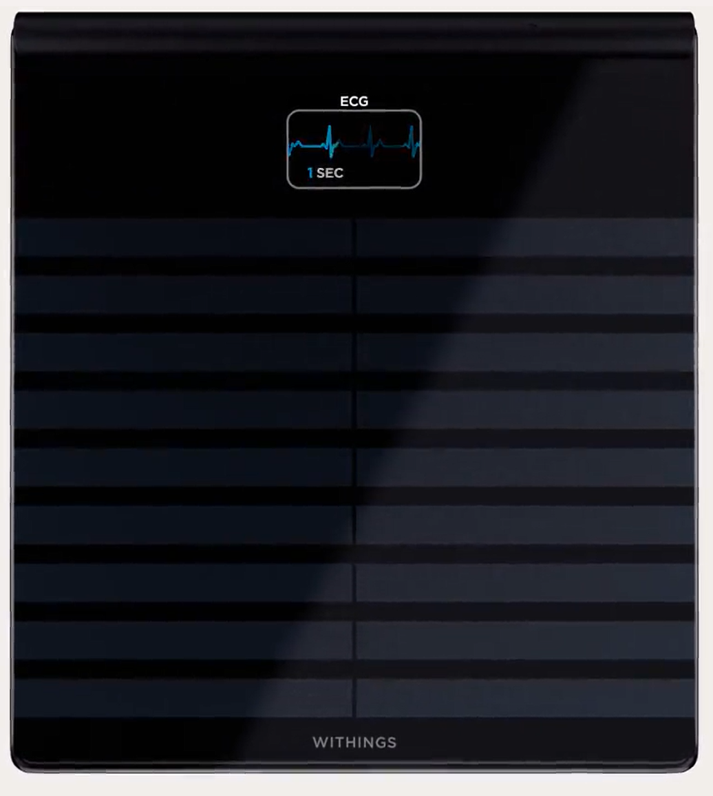
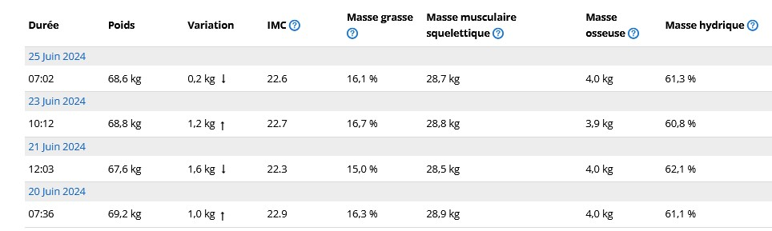
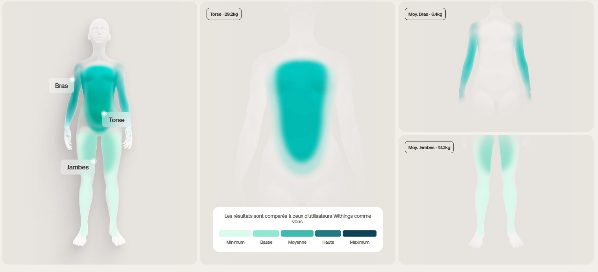
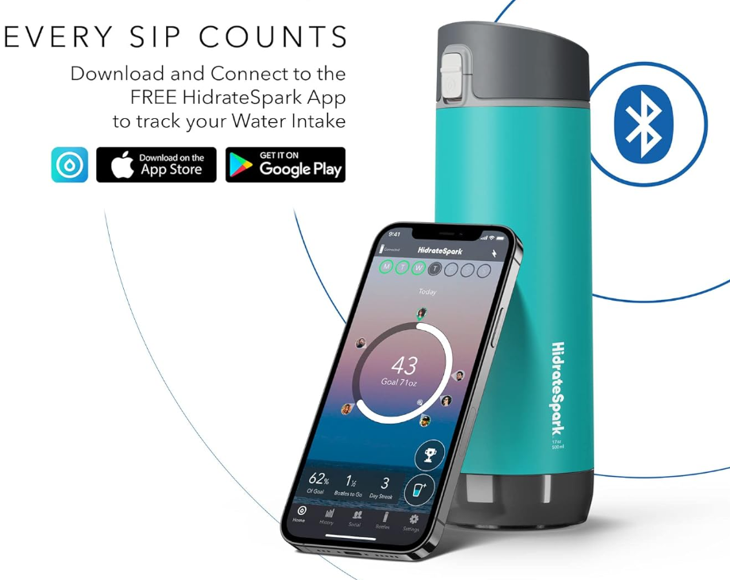
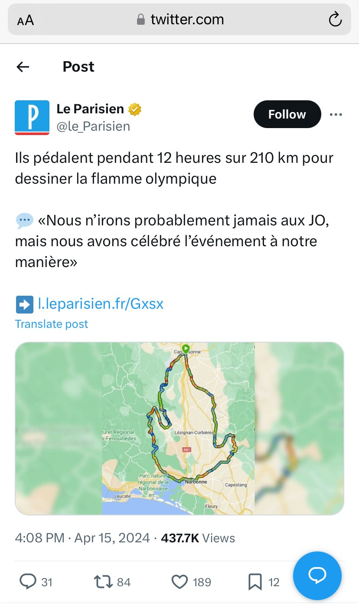
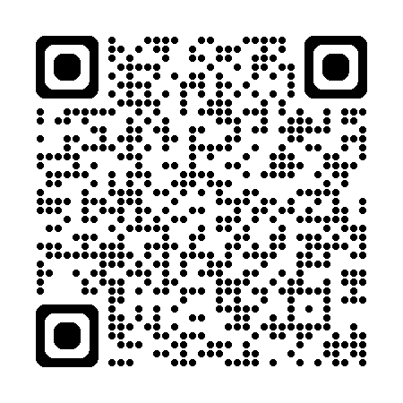

<!--
_class: lead invert
_paginate: skip
_header: ""
_footer: ""
-->

# Disclaimer
* Duration 50min
    * ~ 25 to 35 min slides
    * 20 min Code demo (up to you to decide at the end)
* Les demos serront differentes (setup + camera 4K/60fps)
* Le PC serra different (PC perso avec logiciel camera)
*  __Feedback Welcome__
    * Pas de correction orthographiques/tournures
    * Les conclusions ne sont pas parfaites
    * Il y a encore quelques glitch de generations
* Final QR will be updated with Riviera Dev Open Feedback
---

<!--
_class: lead invert
_paginate: skip
_header: ""
-->

# Le triathlon de la data sportif
Capture / Analyse / ~~Quantify~~ Exploitation

---

### Whoooo are you hooowouuuh
#### Denis Méline - Sportif

* Sportif depuis 40 ans
* Triathlète depuis un peu plus de 10 ans
* ~200 courses réelles et virtuelles, toutes disciplines confondues.
* Course à pied, cyclisme, natation, trail, triathlon, golf, tir et autres trucs chelou

* 
* 
* 

---

### Whoooo are you hooowouuuh
#### Denis Méline - Ingénieur informatique

* Codeur depuis 45 ans
* DEA informatique théorique
* 25 ans dans l'industrie
* 20 ans à 
* Alpha/beta/contributeur de zwift, garmin, form, runalizer, smashrun, wahoo, decathlon, etc..

---

# Agenda

* Capture -> Capteurs
    * Precision
    * Type
* Analyse
    * Contexte
    * Paramètres
* Quantify (plutôt utiliser/expoiter) <!-- Quantifier? -->
    * Utilisation personnelle
    * Exploitations marketing
* Code mais fun
    * On peut faire quoi avec tout ça ?
<!-- 
50 min de talk

30 min de presentation
3 Axes
* le materiels, les capteurs utilise
* les data que ces capteurs nous fournisse
* comment et pourquoi les montres, platformes utilisent ces donnes. Et ce que nous pouvons en tirer, ou les exploiter

* Et en seconde partie, on regardera un peu de code dans ce sens.
Cette partie durera 20 min de code/demos/questions

-->

---

<!--
_class: lead invert
-->
# Capture
### General
---

# Historique
* Montre chronographe puis chronomètre
* Compteur vélo (câble, électronique avec aimant)
* Podomètre, GPS
* Multiples matériels
* Intégration
* Explosion de l'utilisation depuis 5 ans
* Etude de 2023 [Source](https://filieresport.com/fr/telechargements?k=24166577&u=%2Fsante-et-bien-etre%2F2023-06-12%2Fdocuments-en-telechargements-libres&from=articles&f=odr2023_701338359.pdf&d=20230616+19%3A51%3A32&i=4815&vx=433159755)
<!--
* Source : https://filieresport.com/fr/telechargements?k=24166577&u=%2Fsante-et-bien-etre%2F2023-06-12%2Fdocuments-en-telechargements-libres&from=articles&f=odr2023_701338359.pdf&d=20230616+19%3A51%3A32&i=4815&vx=433159755
* Finalement, peu de type de capteurs comparer aux exploitations
-->

---

# Les capteurs communs

* Temps !
* Fréquence cardiaque
    * Ceinture (électrique), optique
* Positionnement (GPS …)
* Accéléromètre / Gyroscope
    * Capteur de foulée
    * Cadence/vitesse en vélo
    * Autres (Golf, natation, etc..)
* Baromètre
* Oxymètre

<!-- 
GPS (US), Galileo (EU), Beidou (CH), Glonass (RU), QZSS (JP)
-->

---

# Les capteurs avancés

* ECG
* Thermomètre
* Puissance/couple
* Pression
* Glycémie
* Tensiomètre
* Contacteurs

<!-- 
Pression pour l'aero
Contacteurs pour le vitesse vélo
-->
---

# Les capteurs "exotiques"

* Luminosité
* UV
* Lidar
* Radar
* Photos
* Videos (Positionnement)
* Débitmétre (t'as bu combien d'eau ce matin ? 😁)
<!-- 
* Lidar *(Light Detection and Ranging - Ondes dans le spectre visible - Courte distance, tres précis)*
* Radar *(Radio Detection and Ranging - Ondes electromagnetiques - Grande distance, peu précis)*
* Luminosite : pour les ecrans mais aussi pour les feux velo ou meme frontale
-->

---

# Cas particuliers

* Balance (Poids, masse hydrique, masse osseuse, etc...)
* Puce de chronométrage
* Batteries (montre, capteurs, vélo électrique, etc..)
* Aero

---

<!--
_class: lead invert
-->
# Capture
### Détails

---

# La fréquence cardiaque
* Début pour le public : Polar ~1980
    * Transferts via … Infrarouge Polar SxxX
    * Mais aussi .. Flashlights (Polar FTx)

<!-- 
Focus sur les principaux capteurs, les plus ancien, et c'est valables pour la majorité
-->

---

# La fréquence cardiaque
* Fréquence cardiaque
    * Ceinture (électrique)
        * Fiable, précis, temps de réponse réduit
        * PB :  confort (proche du cœur), peu pratique, encore plus pour les femmes.
    * Optique ~2017
        * LEDs + photodiode pour enregistrer la taille des vaisseaux sanguins.
        * PB : Temps de réponse, Température, Eau, peau
    * ECG ~2023
        * Signaux électriques du coeur
    * ~ Variabilité cardiaque (VFC, intervalle entre R-R)
<!-- 
-->

---

# Le positionnement
* GPS, Galileo, Beidou/Compass, Glonass, QZSS,…
* Au debut, module GPS separé + PDA (non je n'etais pas le seul !)
* Ma première montre GPS - 2010
    * GPS uniquement
    * 8 satelites max
    * Précision quelques mètres
    * Fort impact de l'environnement
    * Aucune correction

<!-- 
GPS (US), Galileo (EU), Beidou (CH), Glonass (RU), QZSS (JP)
-->
---

# Le positionnement
* 2024
    * Multiband
    * Multiples satellites
    * Précision < mètre
    * Stabilité
        * Corélation avec d'autres capteurs, comme l'altimètre, le podomètre.
    * Fiabilité
        * Dans les forêts, en mer, entre les immeubles, avec perturbations électroniques/magnétiques.

<!-- 
-->

---

<!--
_class: lead invert
-->
# Analyses

<!--
Analyse brute, on prend juste en compte le contexte, pas "trop" d'algorithme.
Juste du nettoyage, raffinement
-->
---

# La fréquence cardiaque

* Context de capture
    * Sommeil
    * Course à pied, vélo, natation
        * Le "profil" utilisé impacte l'algorithme de lissage et de correction utilisé.
* Frequence d'échantillonage
* Type
    * Optique
    * Electrique

---

# La fréquence cardiaque

* FCMax
* FCRecuperation
    * 2min apres FCMax
* VFCRepos
    * Calcul VFC la nuit
* Variabilité cardiaque (VFC)
    * https://www.researchgate.net/profile/Marco-Altini

---

# Le positionnement

* Context de capture
    * Course à pied, vélo, natation
        * Le "profil" utilisé impacte l'algorithme de lissage et de correction utilisé.
* Frequence d'échantillonage
* L'ajout de capteurs correctif/amélioratif
    * altimètre
    * baromètre
    * podomètre
* Navigation/Retour Maison/Itineraire

<!-- 
Par exemple dans le sport mecaniques, la frequence d'echantillonage est importante, on peut rater quelques metres de precisions uniquement due à la vitesse
-->

---

# Capteur de puissance

* Watts
* Puissance specifique W/kg
* W' (W prime), xPower
* L'equivalent du cardio mais pour le velo

* 
* 

* https://journals.physiology.org/doi/pdf/10.1152/advan.00078.2011

---

# Vitesse electrique
* Shimano (filaire)
* SRAM (sans fils)
* Position du plateau, des pignons
* Radio
* 

---

# Radar velo
* Garmin, iGP, Wahoo, Sigma
* Pour la securite
    * Changement de l'eclairage
    * Detection des vehicules et leur type
    * Detection des vitesses des vehicules

---

# Capteur Glycémie

* SuperSapiens
    * https://www.supersapiens.com/fr-FR/
* Demo
    
* Mainteant interdit en compétition
<!-- 
-->

---

# Oxymetre

* Moxy
    * % SmO2 (skeletal muscle oxygen saturation)
    * Optimisation de la performance
    * https://www.moxymonitor.com/

* https://www.blog.nolio.io/post/tout-savoir-sur-le-moniteur-doxygene-musculaire-moxy
* https://pubmed.ncbi.nlm.nih.gov/37261552/

<!-- 
-->

---

# Capteur .....

---

# Capteur Sueur
* Le but étant de minimiser la perte hydrique et minérale/electrolytes (majoritairement sodium, potassium, magnésium, zinc)
* Protocole de base
    * Pesée
    * 1h intensive en condition
    * Pesée
    * Différence = perte hydrique ~ 700ml -> 1L

----

* Pourquoi ?
    * Retenir l'eau
    * Si la concentration de sodium chute -> besoin d'eau ++
    * Limite d'absorption (à l'effort) ~ 400/500ml/h
    * Santé
        * Crampes
        * Nausées
        * Confusion
        * Troubles de la conscience
* https://hdroptech.com/
* https://www.gatorade.com/equipment/gx-sweat-patch/gx-sweat-patch-00052000052596

---

# Capteur température
* http://www.ncbi.nlm.nih.gov/pmc/articles/PMC3359364/
* 
* 

<!-- 
* Impact important !
https://corebodytemp.com/products/core
-->

---

# Radar/Lidar de Golf

* 40 paramètres
* Garmin
* Trackman 
* FlightScope 

<!--
 -Pas d'interpretation
 * Trackman, FlightScope
 * https://www.trackman.com/fr
 * Garmin Approach
-->

---

# Laser de Golf

* Mesure de distance
* Avant optique, mainteant laser
* La nouveautees c'est le partage d'informations
* https://www.garmin.com/fr-FR/p/1411809

<!--
 -Pas d'interpretation
-->

---

# Capteur de club de golf

* Angles
* Vitesse
* Impact
* TrueSwing 

<!--
* https://www.garmin.com/fr-FR/p/605172/pn/010-01994-00
-->
---

# Capteur de pression

* Pression suspensions
    * Pour le confort (et la perf)
* Pression pneus
    * Pour la sécurité (et la perf)
* Aero en temps reel
    * Multiples capteurs (dont pression de l'air)
    * Optimisation pour les pros

<!--
    * https://www.sks-germany.com/fr/airspy/
    * https://www.sram.com/en/quarq/series/tyrewiz

    * https://fr.aeroscale.bike/
    * https://www.bodyrocket.cc/how-does-it-work

Body Rocket utilise une combinaison de plusieurs capteurs
Puissance, Pression de l'air, vitesse du vent, vitesse, accelération, inclinaison, poids pour 
fournir un coefficient en temps reel.
-->

---

# Capteur de pression

* Semelles pour le golf
    * 18 capteurs pour fournir angles, impact, symétrie, etc...
    * Optimisation pour les pros
    * https://www.bal-on.golf/
* Semelles pour la course à pied
    * https://www.digitsole.com/running-analysis

<!--
Golf -> focus performance
Course à pied -> focus diminution risque de blessure, de moins en moins pour le grand public
-->

---

<!--
_class: lead invert
-->
# Exploitation

---

# Le journal d'entrainement (Training log)
* Papier
* En ligne
* Application

<!--
Y a 40 ans, FC avant, 1500m, FC, puis 2min apres FC
-->

---

# Plateformes

##### Applications dédiées
https://www.strava.com/
https://runalyze.com/
https://smashrun.com/
https://www.nolio.io/
https://web.gutai.training/login
https://intervals.icu/
https://app.campus.coach/

---

# Plateformes

##### Constructeurs (voir plus loin)
https://connect.garmin.com/
https://flow.polar.com/
Application mobile suunto

##### Applications sponsors équipementiers (voir plus loin)
https://www.runtastic.com/ (Adidas)
https://beta.trainasone.com/ (Hoka)
https://www.nike.com/nrc-app (Nike)
https://runkeeper.com/ (Asics)

---
# Platformes

##### AI (Bien sûr !)
https://en.run-motion.com/
https://humango.ai/
https://aiendurance.com/
https://www.sciencetraining.io/

---

# Platformes
* Certaines métriques utilisent, en partie, l’auto évaluation
    * Très facile -> très difficile
    * Sensation : Horrible -> très fort
* C’est très subjectif et sujet à interprétation voire erreur.
* Les algorithmes utilisés sont parfois publics, parfois sous licence, et souvent secrets.
* Produits par la recherche mais aussi les plateformes et les constructeurs (d’où leur propre plateformes)
* Démo : Runalyze (https://runalyze.com/)

<!--

-->
---
# Resultats

* 
* 
* 
* 

* 
* 

---
# Prediction de course

* Top ! … pas si sûr 
* Multiples méthodes (Dave Cameron, Pete Riegel, Robert Bock (CPP), Herbert Steffny)
* On peut hacker : https://pubmed.ncbi.nlm.nih.gov/2022559/

---

# Vo2Max

* Vo2Max = La consommation maximale d'oxygène que l'organisme peut absorber lors d'un effort physique intense
* En réalité -> Prédiction de Vo2Max
* Excellent ?
* Pas si sûr...
* L'algorithme de calcul -> Firstbeat, secret déso 😅
    * Age, poids, cardio, ...

<!--
https://www.youtube.com/watch?v=rMLYizEoVBI
https://www.youtube.com/watch?v=u-5UOPwCWHk
https://www.im2s.mc/evaluation-de-la-forme-physique-les-tests-deffort/
-->

---
# Test Vo2Max

<!--
https://www.youtube.com/watch?v=rMLYizEoVBI
https://www.youtube.com/watch?v=u-5UOPwCWHk
https://www.im2s.mc/evaluation-de-la-forme-physique-les-tests-deffort/
-->

---
# Analyse avec les capteurs de mouvements

---
# Analyse avec les capteurs de mouvements
* Equilibre
* Efficacite de la foulee
* Détection d’incident
    * Avant pour les voitures si elles étaient renversées (Au US)
* Invitation a bouger (meme apres un marathon 😅)

<!--
Pour une voiture, c'est assez facile, si elle est sur le toit, c'est mauvais signe.
Inivatio a bouger, on verra ca dans la partie code aussi.
-->
---
# Lunette Engo

* Uniquement écran deporté
* Aucun capteur
    * enfin si, capteur de luminosite pour ajuster l'écran, mais aucune data produite
* Démo

<!--
Source : https://fr.engoeyewear.com/produits/engo-2
-->

---

# Lunette Form

* Capteurs classiques (gyros, mouvements)
* Combinaison avec des capteurs existants
    * Depuis la montre
    * Depuis un capteur externe (cardio)
* Autorisée en competition !
* Démo

<!--
Source : https://www.formswim.com/
-->

---

# Eolab

* Capteurs classiques
    * Capteurs de mouvements
        * Gyroscope
        * Gyrometre
        * Accelerometres
    * Pressions (sur et sous la main)
* https://www.eolab.com/swimbetter
* https://link.springer.com/article/10.1007/s00283-024-10339-0

* 
* 

<!--
* Source : https://www.youtube.com/watch?v=uK8ao6-hpcY&ab_channel=eo
-->

---
# Balance connectée

* 
* 
* 

* Poids
* IMC
* Masse grasse
* Masse musculaire
* Masse osseuse
* Masse hydrique
* Tension
* ECG

---
# Gourde intelligente

---

# Photos et videos
* Positionnement
    * Sur le vélo
    * Golf
    * Natation
* Confort
* Optimisation de l'aero
    * En complément des capteurs

---
# HeatMap

<!--
Bias de selection : nombre de nageurs + nombre qui ont une montre

Zone d'exclusion:
https://www.sbs.com.au/news/article/a-russian-commander-was-killed-while-jogging-was-he-tracked-through-a-fitness-app/h0vd6ucxd

-->

---
# HeatMap

* Les routes/chemins les plus empruntés/validés et securisés
    * Utilisation des donnees des radars/lidar
* HeatMap Nuit, pour les routes sure/pratique la nuit 
* Nouvelle HeatMap contextualisee

* Source : https://www.dcrainmaker.com/2024/05/strava-announces-new-summer-2024-features.html

---
# Musique

* Pas un capteur mais plutôt l'exploitation d'informations
* Améliore les performances

* Source : https://www.ncbi.nlm.nih.gov/pmc/articles/PMC7281270/
* Méta analyse : https://www.ncbi.nlm.nih.gov/pmc/articles/PMC8167645/

---
# Utilisation pour le confort et la performance

* Passage de vitesses automatiques sur le vélo 
    * Capteur de puissance, capteur de cadence, vitesse et dérailleurs pilotés électroniquement (avec ou sans fils)

* Source : https://www.decathlon.fr/p/velo-vtt-electrique-all-mountain-tout-suspendu-29-e-feel-900-s/_/R-p-330262

---
# Grade ajusted peace
https://support.strava.com/hc/fr/articles/216917067-Vitesse-ajust%C3%A9e-selon-la-pente-VAP

* Confirmation par des études scientifiques.
    * Energy cost of walking and running at extreme uphill and downhill slopes https://journals.physiology.org/doi/full/10.1152/japplphysiol.01177.2001 

---

# Age ajusted peace

* https://www.triathlete.com/culture/news/how-much-slower-will-you-get-as-you-age-up-in-triathlon/
* Confirmation par des études scientifiques
    * https://pubmed.ncbi.nlm.nih.gov/2504587/
    * https://www.ncbi.nlm.nih.gov/pmc/articles/PMC2375571/

* 
* 
* 
* 

---
# Wind adjusted pace ?

Il existe des formules mais tout est subjectif, il n'y a pas encore de capteurs (hors aero pour le velo)
Strava ne va pas aider, car le vent est environemental, entre les batiments, ou en ras campagne c'est pas la meme limonade.

https://www.youtube.com/watch?v=IoX-JUPvrwo

---
# Des data pour le virtuel

* Simulation du terrain (Plaques vibrantes + angles)
* Simulation de la pente (+20% -10%)
* Simulation du vent (48km/h !)
    

<!--
Manual Mode: Select from four speed settings to set you ideal airflow
Speed Mode: Pair to KICKR or speed sensor to match fan speed to bike speed
Heart Rate Mode: Pair to ANT+ heart rate monitor to increase airflow as heart rate goes up
-->

---
# Des data pour le virtuel - Trackman, FlightScope, Garmin, TopTracer

* 
* 

<!--
Video + donnee GPS nettoye
-->

---
# Des data pour le virtuel - FulGaz, Tacx

<!--
Video + donnee GPS nettoye
-->
---
# Des data pour le virtuel - Zwift

<!--
Inclus aussi le tapis de course
Avec vitesse,distance, cadence et inclinaison
-->

---
# Des data pour le virtuel

https://zwiftinsider.com/portal/isola-2000/
https://zwiftinsider.com/portal/la-turbie-col-deze/

---

# Data poisonning

* Involontaire
    * Erreurs GPS
    * Bug de traitement
    * Bug d'upload
    * Brosse à dents electrique (ajoute des pas)

* 
* 
* 

---

# Data poisonning
* **"** Involontaire **"**
    * Vélo à la place de course à pied
    * Vélo electrique à la place de vélo musculaire
    * Moto/voiture à la place de vélo

* Bientot automatique ("AI-Enabled") pour nettoyer les activites incorrectes.

* Source : https://www.dcrainmaker.com/2024/05/strava-announces-new-summer-2024-features.html

---
# Utilisation pour tricher

* Zwift Essoreuse à Salade : https://www.youtube.com/watch?v=K08AlzT6Qu8
* https://www.dcrainmaker.com/2022/12/zwift-uci-cheating-astounding-championship-qualifier.html
* https://www.dcrainmaker.com/2022/02/zwifts-bans-whistleblower-deeper.html

---
* Gagner des courses virtuelles (et donc de cadeaux)
    * Des prix (comme des dossards, ou tirages au sort)
    * Des réductions (pour la revente)
    * Des contrats !
    * Des médailles ! (Demo)

* Contre mesure
    * Double capteur de puissance (Différentes marques)
    * Double caméra (angles différents)

---
# Fun

* Faire de joli dessins
* (Pour l'instant) Fait artisanalement

---
# ESport

* Garmin GameOn

---

<!--
_class: lead invert
-->
# Conclusions

---
# Evolutions des capteurs

### Bientôt (quelques mois)
* Temperature peau + corps (avec capteur dedidé)
    * https://corebodytemp.com/products/core
* Glycémie (avec capteur cardio)
    * https://afontechnology.com/glucowear/
* Tension (avec capteur cardio)

---
# Evolutions des analyses/exploitations

### Quelques années (pour le grand public)
* Morphologique
* Physiologique
* Métabolique
* Analyseur de quantité de mitochondrie

---

# Les principaux bénéfices... pour vous

* Pour apprendre à se connaître
    * Les informations et leurs analyse permettant d’accélérer et affiner le processus
    * On affine les entrainements et les sensations grace a des informations instantanées
    * Retour immediat, correction et validation
    * On reduit les bias du a la subjectivité

<!--
Course enfants : Depart a fond, milieu en PLS, et finish a fond, et vomit :)

retour immediat, correction et validation.
-->

---

# Les principaux bénéfices... pour vous

* Pour sa santé/securite
    * Surveillance, informer, alertes

* Les pro
    * Un peu pour trouver l'optimum de chacun
    * Beaucoup pour prévenir les blessures

* https://www.inria.fr/fr/sport-numerique-prevenir-blessures-athletes-JO
* https://www.garmin.com/fr-FR/blog/les-donnees-des-montres-connectees-garmin-mettent-en-evidence-les-bienfaits-de-la-course-a-pied-sur-la-sante/
* https://www.garmin.com/en-US/blog/health/xps-network-uses-garmin-smartwatch-tech-to-help-boost-athletic-performance/

---

# Resumé

* Capteurs
    * Attention au context de capture !
* Analyse
    * Encore une fois le context
    * Les combinaisons qui peuvent entrainer des biais
* Exploitation
    * Pour la performance (ça c'est pour vendre)
    * Pour le marketing (voir le point au dessus 😁)
    * La valeur réelle pour vous !
        * Pour se connaitre, la santé, la sécurité
        * La prévention des blessures (l'utilisation majeure des pro)
<!-- 
Speaker notes : None
-->

---
# Création du triathlon

* 18 Février 1978
* Pas de capteurs, même pas de matériel dédié … et des temps excellents !

* 
* 
* 
* 

---

<!--
_class: lead invert
_paginate: skip
_header: ""
_footer: ""
-->
# Merci !

<!--
---
# Tableau

| Titre 1       |     Titre 2     |        Titre 3 |
| :------------ | :-------------: | -------------: |
| Colonne       |     Colonne     |        Colonne |
| Alignée à     |   Alignée au    |      Alignée à |
| Gauche        |     Centre      |         Droite |

---

<!-- _footer: "1. www.google.com" -->

<!--
# Slide 2

- Footnote and superscript link [1][1].

[1]: https://www.google.com

---

# Conclusion

mindmap
  ((Data))
    )Santé(
    ::icon(fa-solid fa-house-medical)
    )Securité(
     ::icon(fa-solid fa-user-secret)
    )Recherche(
    ::icon(fa-solid fa-graduation-cap)
    )Connaissance(
    ::icon(fa fa-book)
    )Performance(
    ::icon(fa-solid fa-person-running)

---

# Conclusion

sankey-beta

%% source,target, value
Data,Sante,100
Data,Connaissance,100
Data,Recherche,50
Data,Securite,25

-->