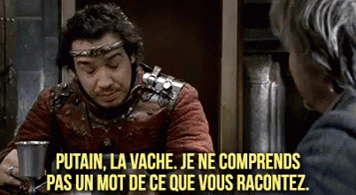

<!--
_class: lead invert
_paginate: skip
-->

# Le triathlon de la data sportif
Capture / Analyse / ~~Quantify~~ Exploitation

---

### Whoooo are you hooowouuuh
#### Denis Méline - Sportif

* Sportif depuis 40 ans
* Triathelete depuis un peu plus de 10 ans
* ~200 courses réelles et virtuelles, toutes disciplines confonudus. (Course à pied, trail, natation, triathlon, golf et autres trucs chelou)

- 
- 
- 

---

### Whoooo are you hooowouuuh
#### Denis Méline - Ingénieur informatique

* Codeur depuis 45 ans
* DEA informatique théorique
* 25 ans dans l'industrie
* Alpha test/contributeur de zwift, garmin, runalizer, smashrun, etc..

---

# Agenda

* Capture
    * Capteurs
        * Precision
        * Type
* Analyse
    * Contexte
    * Paramètres
* Quantify (plutôt utiliser/expoiter)
    * Utilisations personnelle
    * Exploitations marketing
* Code mais fun
    * On peut faire quoi avec tout ça ?
<!-- 
Speaker notes : None
-->

---

<!--
_class: lead invert
-->
# Capture
### General
---

# Historique
* Montre chronographe puis chronometre
* Compteur vélo (cable, electronique avec aimant)
* Podometre, GPS
* Multiples matériels
* Integration
* Explosion des utilisations depuis 5 ans
<!--
* Source : https://filieresport.com/fr/telechargements?k=24166577&u=%2Fsante-et-bien-etre%2F2023-06-12%2Fdocuments-en-telechargements-libres&from=articles&f=odr2023_701338359.pdf&d=20230616+19%3A51%3A32&i=4815&vx=433159755
* Finalement, peu de type de capteurs comparer aux exploitations
-->

---

# Les capteurs communs

* Temps !
* Fréquence cardiaque
    * Ceinture (électrique), optique
* Positionnement (GPS, Galileo, Beidou/Compass, Glonass, QZSS,…)
* Accéléromètre / Gyroscope
    * Capteur de foulée
    * Cadence/vitesse en vélo
    * Autres (Golf, natation, etc..)
* Baromètre
* Oxymètre

<!-- 
GPS (US), Galileo (EU), Beidou (CH), Glonass (RU), QZSS (JP)
-->

---

# Les capteurs avancés

* ECG
* Thermomètre
* Puissance/couple
* Pression
* Glycémie
* Tensiomètre
* Contacteurs

<!-- 
Pression pour l'aero
Contacteurs pour le vitesse vélo
-->
---

# Les capteurs "exotiques"

* Luminosité/UV
* Lidar
* Radar
* Photos
* Videos (Positionnement)
* Débitmétre (t'a bu combien d'eau ce matin ? 😁)
<!-- 
* Lidar *(Light Dectection and Ranging - Ondes dans le spectre visible - Courte distance, tres précis)*
* Radar *(Radio Dectection and Ranging - Ondes electromagnetiques - Grande distance, peu précis)*
-->

---

# Cas particuliers

* Balance (Poids, masse hydrique, masse osseuse, etc...)
* Puce de chronométrage
* Batteries (montre, capteurs, vélo électrique, etc..)
* Aero

---

<!--
_class: lead invert
-->
# Capture
### Détails

---

# La fréquence cardiaque
* Début pour le publique : Polar ~1980
    * Transferts via … Infrarouge Polar SxxX
    * Mais aussi .. Flashlights (Polar FTx)

<!-- 
Focus sur les principaux capteurs, les plus ancien, et c'est valables pour la majorité
-->

---

# La fréquence cardiaque
* Fréquence cardiaque
    * Ceinture (électrique)
        * Fiable, précis, temps de réponse réduit
        * PB :  confort (proche du cœur), peu pratique, encore plus pour les femmes.
    * Optique ~2017
        * LEDs + photodiode pour enregistrer la taille des vaisseaux sanguins.
        * PB : Temps de réponse, Température, Eau, peau
    * ECG ~2023
        * Signaux électriques du coeur
    * ~ Variabilité cardiaque (VFC, intervale entre R-R)
<!-- 
-->

---

# Le positionnement
* GPS, Galileo, Beidou/Compass, Glonass, QZSS,…
* Au debut, module GPS separé + PDA
* Ma premiere montre GPS - 2010
    * GPS uniquement
    * 8 satelites max
    * Precisions quelques metres
    * Fort impact de l'environement
    * Aucune corrections
---

# Le positionnement
* 2024
    * Multiband
    * Multiples satelites
    * Precisions < metre
    * Stabilité
        * Corelation avec d'autres capteurs, comme l'altimetre, le podometre.
    * Fiabilité
        * Dans les forêts, en mer, entre les immeubles, avec perturbations electroniques/magnétiques.

<!-- 
-->

---

<!--
_class: lead invert
-->
# Analyses

<!--
Analyse brute, on prend juste en compte le context, pas "trop" d'algorythme.
Juste du nettoyage, rafinement
-->
---

# La frequence cardiaque

* Context de capture
    * Sommeil
    * Course a pied, vélo, natation
        * Le "profil" utilisé impact l'algorithme de lissage et de correction utilisé.
* Frequence d'échantillonage
* Type
    * Optique
    * Electrique

---

# La frequence cardiaque

* FCMax
* FCRecuperation
    * 2min apres FCMax
* VFCRepos
    * Calcul VFC la nuit
* Variabilite cardiaque (VFC)
    * https://www.researchgate.net/profile/Marco-Altini

---

# Le positionement

* Context de capture
    * Course a pied, vélo, natation
        * Le "profil" utilisé impact l'algorithme de lissage et de correction utilisé.
* Frequence d'échantillonage
* L'ajout de capteurs correctif/amelioratif
    * alimetere
    * barometre
    * podometre

---

# Capteur de puissance

---

# Vitesse electrique

---

# Radar velo

---

# Radar/Lidar de Golf

* 40 parametres
* https://www.trackman.com/fr

<!--
 -Pas d'interpretation
-->
---

# Capteur de club de golf

https://www.garmin.com/fr-FR/p/605172/pn/010-01994-00

---

# Capteur Glycémie

* SuperSapiens
    * https://www.supersapiens.com/fr-FR/
* Demo
* Mainteant interdit en compétitions
<!-- 
-->

---

# Capteur ??

---

# Capteur Sueur
* Le but étant de minimiser la perte hydrique et minérales/electrolytes (majoritairement sodium, potatium, mg, zinc)
* Protocole de base
    * Pesé
    * 1h intensive en condition
    * Pesé
    * Difference = perte hydrique ~ 700ml -> 1L

----

* Pourquoi ?
    * Retenir l'eau
    * Si la concentration de sodium chute -> besoin d'eau ++
    * Limite d'absortion (à l'effort) ~ 400/500ml/h
    * Santé
        * Crampes
        * Nausées
        * Confusion
        * Trouble de la conscience
* https://hdroptech.com/
* https://www.gatorade.com/equipment/gx-sweat-patch/gx-sweat-patch-00052000052596

---

# Capteur temperature
* 
* http://www.ncbi.nlm.nih.gov/pmc/articles/PMC3359364/

<!-- 
* Impact important !
https://corebodytemp.com/products/core
-->

---

# Capteur de pression

* Pression pneus
    * https://www.sks-germany.com/fr/airspy/
    * Focus sur la securite
    * Demo
* Aero en temps reel
    * https://fr.aeroscale.bike/
    * https://www.bodyrocket.cc/how-does-it-work
<!--
* Optimization pour les pros

Body Rocket utilise une combinaison de plusieurs capteurs
Puissance, Pression de l'air, vitese du vent, vitesse, accelration, inclinaison, poids pour 
fournir un coeficient en temps reel.
-->

---

# Capteur de pression

* Semelles pour le golf
    * 18 capteurs pour fournir angles, impact, symetrie, etc...
    * Optimization pour les pros
    * https://www.bal-on.golf/
* Semelles pour la course a pied
    * https://www.digitsole.com/running-analysis

<!--
Golf -> forcus performance
Course a pied -> focus diminution risque de blessure, de moins en moins pour le grand public
-->

---

<!--
_class: lead invert
-->
# Exploitation

---

# Le journal d'entrainement (Trainning log)
* Papier
* En ligne
* Application

---

# Platformes

##### Applications dédiées
https://www.strava.com/
https://runalyze.com/
https://smashrun.com/
https://www.nolio.io/
https://web.gutai.training/login
https://intervals.icu/
https://app.campus.coach/

---

# Platformes

##### Constructeurs (see after)
https://connect.garmin.com/
https://flow.polar.com/
Application mobile suunto

##### Applications sponsors équipementiers
https://www.runtastic.com/ (ADDIDAS)
https://beta.trainasone.com/ (Hoka)
https://www.nike.com/nrc-app (Nike)
https://runkeeper.com/ (ASICS)

---
# Platformes

##### AI (Biensur !)
https://en.run-motion.com/
https://humango.ai/
https://aiendurance.com/
https://www.sciencetraining.io/

---

# Platformes
* Certaines métrique utilise en partie, l’auto évaluation
    * Très facile -> très difficile
    * Sensation : Horrible -> très fort
* C’est très subjectif et sujet a interprétation voir erreur.
* Les algorithmes utilisés sont parfois publique, parfois sous licence, et souvent secret.
* Produit par la recherche mais aussi les plateformes et les constructeurs (d’où leur propre plateformes)
* Demo : Runalyze (https://runalyze.com/)

---
# Resultats

* 
* 
* 
* 

* 
* 

---
# Prediction de course

* Top ! … pas si sûr 
* Multiples methodes (Dave Cameron, Pete Riegel, Robert Bock (CPP), Herbert Steffny)
* On peut hacker : https://pubmed.ncbi.nlm.nih.gov/2022559/

---

# Vo2Max

* Vo2Max = La consommation maximale d'oxygène que l'organisme peut absorber lors d'un effort physique intense
* En réalité -> Prédiction de Vo2Max
* Excelent ?
* Pas si sûr...
* L'algorythme de calcul -> Firstbeat, secret déso 😅
    * Age, poids, cardio, ...

<!--
https://www.youtube.com/watch?v=rMLYizEoVBI
https://www.youtube.com/watch?v=u-5UOPwCWHk
https://www.im2s.mc/evaluation-de-la-forme-physique-les-tests-deffort/
-->

---
# Test Vo2Max

<!--
https://www.youtube.com/watch?v=rMLYizEoVBI
https://www.youtube.com/watch?v=u-5UOPwCWHk
https://www.im2s.mc/evaluation-de-la-forme-physique-les-tests-deffort/
-->

---
# Analyse avec les capteurs de mouvements

---
# Lunette Engo

* Uniquement ecran deporté
* Aucun capteur
    * enfin si, capteur de luminosite pour ajuster l'ecran, mais aucunes data produites
* Demo

<!--
Source : https://fr.engoeyewear.com/produits/engo-2
-->

---

# Lunette Form

* Aucun nouveau capteurs, uniquement l'utilisation de ceux-ci
* Combinaison avec des capteurs existants
    * Depuis la montre
    * Depuis un capteur externe (cardio)
* Autorisée en competition !
* Demo

<!--
Source : https://www.formswim.com/
-->

---

# Eolab

* https://www.eolab.com/swimbetter
* Source : https://www.youtube.com/watch?v=uK8ao6-hpcY&ab_channel=eo

* 
* 

---
# Balance connectée

* 
* 
* 

* Poids
* IMC
* Masse grasse
* Masse musculaire
* Masse osseuse
* Masse hydrique
* Tension
* ECG

---
# Gourde intelligente

---

# Photos et videos
* Positionement
    * Sur le vélo
    * Golf
    * Natation
* Confort
* Optimisation de l'aero
    * En complement des capteurs

---
# Utilisation pour la securité

* Detection d’incident
    * Avant pour les voitures si elles étaient renverser (Au US)
* Heat map de strava
    * Les routes/chemins les plus empruntés/validés et securisés

<!--
Pour une voiture, c'est assez facile, si elle est sur le toit, c'est mauvais signe.
-->
---
# HeatMap

<!--
Bias de selection : nombre de nageurs + nombre qui ont une montre

Zone d'exclusion:
https://www.sbs.com.au/news/article/a-russian-commander-was-killed-while-jogging-was-he-tracked-through-a-fitness-app/h0vd6ucxd

-->

---
# HeatMap

* Adding night heat maps to show which routes are better/safer for night workouts
* Adding new “Athlete Intelligence” feedback, akin to basic coaching feedback on activities
* Adding “AI-Enabled Leaderboard Integrity” to sniff out improbable uploads

Source : https://www.dcrainmaker.com/2024/05/strava-announces-new-summer-2024-features.html

---
# Utilisation pour le confort et la performance

* Passage de vitesses automatiques sur le vélo
    * Capteur de puissance, capteur de cadence, vitesse et dérailleurs piloté électroniquement (avec ou sans fils)

Source : https://www.decathlon.fr/p/velo-vtt-electrique-all-mountain-tout-suspendu-29-e-feel-900-s/_/R-p-330262

---
# Grade ajusted peace
https://support.strava.com/hc/fr/articles/216917067-Vitesse-ajust%C3%A9e-selon-la-pente-VAP

* Confirmation par des études scientifiques.
    * Energy cost of walking and running at extreme uphill and downhill slopes https://journals.physiology.org/doi/full/10.1152/japplphysiol.01177.2001 

---
# Wind adjusted pace ?

Il existe des formules mais tout est subjectif, il n'y a pas encore de capteurs (hors aero pour le velo)
Strava ne va pas aider, car le vent est environemental, entre les batiments, ou en ras campagne c'est pas la meme limonade.

https://www.youtube.com/watch?v=IoX-JUPvrwo

---
# Age ajusted peace
* https://www.triathlete.com/culture/news/how-much-slower-will-you-get-as-you-age-up-in-triathlon/
* Confirmation par des études scientifiques
    * https://pubmed.ncbi.nlm.nih.gov/2504587/
    * https://www.ncbi.nlm.nih.gov/pmc/articles/PMC2375571/

---

---
# Des data pour le virtuel

---
# Des data pour le virtuel

---
# Des data pour le virtuel

https://zwiftinsider.com/portal/isola-2000/
https://zwiftinsider.com/portal/la-turbie-col-deze/

---
# Utilisation pour tricher

* Gagner des courses virtuelles (et donc de cadeaux)
    * Des prix (comme des dossards, ou tirages au sort)
    * Des réductions (pour la revente)
    * Des contrats !

* Demo (non je n'ai pas triche)

---
* Contre mesure
    * Double capteur de puissance (Differentes marques)
    * Double camera (angles differents)

* Source : Zwift Essoreuse à Salade : https://www.youtube.com/watch?v=K08AlzT6Qu8
* https://www.dcrainmaker.com/2022/12/zwift-uci-cheating-astounding-championship-qualifier.html
* https://www.dcrainmaker.com/2022/02/zwifts-bans-whistleblower-deeper.html

---
# Fun

* Faire de joli dessins
* (Pour l'instant) Fait artisanalement

---
# ESport

* Garmin GameOn

---
Data poisonning
* Involontaire
    * 
    * 
    * 

---
Data poisonning
* """"Involontaire"""""
    * Vélo à la place de course à pied
    * Vélo electrique à la place de vélo musculaire
    * Moto/voiture à la place de vélo
---

<!--
_class: lead invert
-->
# Conclusions

---
# Evolutions

### Bientôt (quelques mois)
* Temperature peau + corps (avec capteur dedidé)
    * https://corebodytemp.com/products/core
* Glycémie (avec capteur cardio)
    * https://afontechnology.com/glucowear/
* Tension (avec capteur cardio)

---

# Evolutions

### Quelques années (pour le grand publique)
* Morphologique
* Physiologique
* Métabolique
* Analyseur de quantité de mitochondrie

---

# Conclusion

* Pour se connaitre

* Pour sa santé

* Les pro
    * Pour prévenir les blessures
    * https://www.inria.fr/fr/sport-numerique-prevenir-blessures-athletes-JO

<!--
Course enfants : Depart a fond, milieu en PLS, et finish a fond, et vomit :)
-->

---

# Conclusion

* Apprendre à se connaître, les informations et leurs analyse permettant d’accélérer et affiner le processus
* Accepter car les informations sont instantanées
* Affiner car analyser et on réduit la subjectivité 
* https://www.garmin.com/fr-FR/blog/les-donnees-des-montres-connectees-garmin-mettent-en-evidence-les-bienfaits-de-la-course-a-pied-sur-la-sante/
* https://www.garmin.com/en-US/blog/health/xps-network-uses-garmin-smartwatch-tech-to-help-boost-athletic-performance/

---

# Conclusion
* Capteurs
    * Attention au contexte de capture !
* Analyse
    * Ecnore une fois contexte
    * Les combinaisons qui peuvent entrainer des bias
* Expoitation
    * Pour la performance (ça c'est pour vendre)
    * Pour le marketing (voir le point au dessus 😁)
    * La valeur reele pour vous !
        * Pour se connaitre
        * La prevention des blessures (l'utilisation majeure des pro)
<!-- 
Speaker notes : None
-->

---
# Creation du triathlon

* 18 Février 1978
* Pas de capteurs, même pas de matériel dédier … et des temps de excellent !

* 
* 
* 
* 

---

<!--
_class: lead invert
_paginate: skip
_header: ""
_footer: ""
-->
# Merci !

<!--
---
# Tableau

| Titre 1       |     Titre 2     |        Titre 3 |
| :------------ | :-------------: | -------------: |
| Colonne       |     Colonne     |        Colonne |
| Alignée à     |   Alignée au    |      Alignée à |
| Gauche        |     Centre      |         Droite |

-->